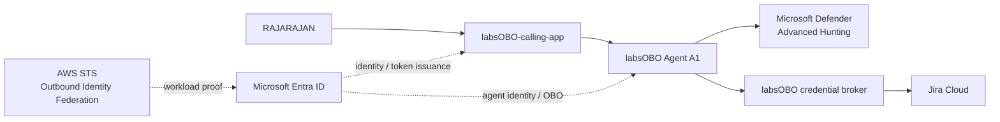
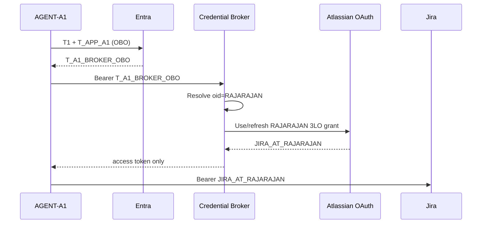
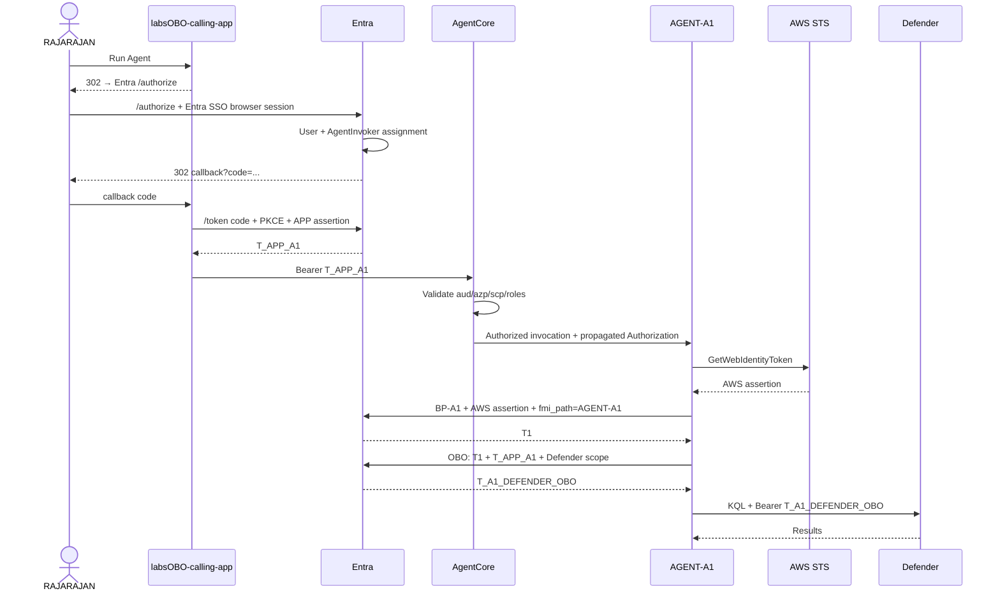
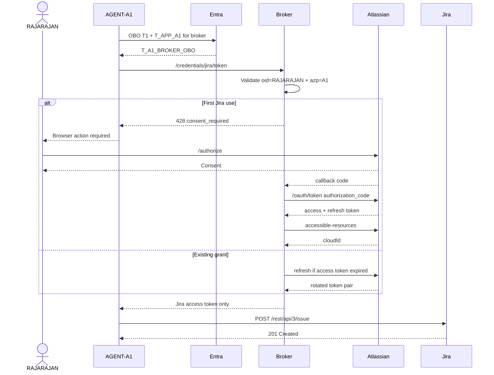

# labsOBO — End-to-End Agent Identity, User Authorization, OBO, Defender, and Jira Lab

> **Goal:** reproduce the `labsOBO` experiment and understand every identity and token hop in it  
> **Primary proof:** carry a signed human identity across an application → agent → downstream API chain while independently proving which agent identity is executing  
> **Lab user:** `RAJARAJAN` (the entitled human); `SAM` is the negative-control user  
> **Updated:** 2026-09-10
> **Version:** v0.1


---

## 0. Executive summary

The labsOBO project validates an end-to-end identity and authorization model for enterprise AI agents operating across multiple systems. The core problem is simple but critical: when multiple users invoke the same agent, downstream systems must be able to determine who initiated the action, which agent executed it, what authority was used, and whether that user was actually entitled to use the agent.
The solution uses Microsoft Entra Agent ID as the identity and authorization control plane. Users are explicitly authorized to invoke an agent through an Entra app-role assignment such as labsOBO.AgentInvoker. The calling application obtains a user-bound token for the agent blueprint, carrying claims such as oid for the human, azp for the calling application, aud for the agent boundary, and roles for user entitlement. AWS AgentCore then validates this token before allowing Agent A1 to execute. Separately, AWS STS workload federation allows the running AgentCore workload to prove its identity to Entra without storing a long-lived agent credential.

The project then demonstrates On-Behalf-Of delegation. When Agent A1 calls Microsoft Defender, Entra combines the original user token with A1's agent identity proof to issue a downstream token where RAJARAJAN remains the human subject while Agent A1 becomes the acting identity. This enables Defender to enforce the user's delegated permissions while preserving agent attribution. The same principle is extended to Jira through a credential broker and Atlassian OAuth, allowing Jira actions to use the user's own Jira authority while retaining a traceable record that Agent A1 performed the action.
The result is a verifiable chain of authority:

RAJARAJAN
    ↓
labsOBO-calling-app
    ↓
labsOBO Agent A1
    ↓
Defender / Jira

At every hop, identity and authorization are carried by signed tokens rather than trusted application parameters or custom logs alone. The project therefore establishes a practical foundation for auditable, least-privilege, multi-user agent execution, where both the human authority and the autonomous agent identity remain distinguishable throughout the workflow.

| Test | Question | Proof |
|---|---|---|
| 1 | Who is the human? | Entra user `oid` in the inbound token |
| 2 | Is this human entitled to invoke this agent? | `labsOBO.AgentInvoker` app-role assignment, emitted as `roles` |
| 3 | Which application invoked the agent? | `azp = labsOBO-calling-app` |
| 4 | When A1 calls downstream, can the token preserve the human **and** identify A1 as the actor? | Agent OBO token: human `oid` + agent `azp` |

```text
AUTHENTICATION
Who is the human?
        ↓
RAJARAJAN

AUTHORIZATION
May this human invoke A1?
        ↓
RAJARAJAN → labsOBO.AgentInvoker → BP-A1

AGENT IDENTITY
Which workload is executing?
        ↓
labsOBO Agent A1

DELEGATION / OBO
Who is A1 acting for downstream?
        ↓
RAJARAJAN
```

The four answers are produced by four different mechanisms: the Entra sign-in session,
an app-role assignment in the directory, a workload credential exchanged for an agent
token, and the on-behalf-of grant. Keeping them separate is the point of the lab.

---

# 1. Target architecture



Three trust domains meet here. Entra issues every token that carries the human.
AWS proves which workload is running A1. Atlassian issues its own tokens and never
sees an Entra token; the broker is the only component that understands both.

### Downstream operating modes

```text
DEFENDER PATH USED IN THE MAIN LAB
----------------------------------
RAJARAJAN → APP → A1 → Defender
                    ^
                    |
              OBO RAJARAJAN

Downstream Defender token:
oid = RAJARAJAN
azp = AGENT-A1
scp = AdvancedHunting.Read


JIRA PATH
---------
RAJARAJAN → APP → A1 → Entra OBO → Broker
                                      |
                               Atlassian 3LO grant
                                      |
                                      v
                                     Jira

Entra proves:
user = RAJARAJAN
actor = AGENT-A1

Atlassian proves:
Jira authority = RAJARAJAN
```

In the Defender path a single identity provider (Entra) carries the human all the way
to the resource. In the Jira path the human's authority is re-established in a second
identity domain (Atlassian), and the broker is where the two are joined by the
immutable Entra `oid`.

---

# 2. Important definitions

| Term | Meaning in this lab |
|---|---|
| `labsOBO-calling-app` | The confidential web/BFF application the human uses. It is an OAuth client, never a resource. |
| `BP-A1` | `labsOBO-agent1-blueprint`: the Entra Agent Identity Blueprint. It is the inbound OAuth **resource boundary** for A1 (it owns the identifier URI, the delegated scope, and the app role) and the parent of the agent identity. |
| `AGENT-A1` | The child Entra Agent Identity that represents the executing A1 agent. It is a service principal with no credential of its own. |
| AgentCore Runtime | The AWS Bedrock AgentCore runtime that hosts A1 and validates inbound JWTs before any container runs. |
| `T_APP_A1` | The delegated Entra access token the application obtains for BP-A1 and sends to AgentCore/A1. It carries the human. |
| AWS workload assertion | An AWS STS-signed JWT proving the IAM execution principal of the AgentCore runtime. |
| `T1` | The Entra token that lets the child `AGENT-A1` authenticate without holding its own secret or certificate. It is a credential for the next exchange, not a resource token. |
| `T_A1_DEFENDER_OBO` | The delegated Defender token: RAJARAJAN is the subject, A1 is the actor. |
| Broker | An application-owned credential service that verifies Entra OBO tokens and manages Atlassian tokens on the user's behalf. |
| `JIRA_AT_RAJARAJAN` | The Atlassian access token delegated by RAJARAJAN. |
| `JIRA_RT_RAJARAJAN` | The Atlassian rotating refresh token. It never leaves the broker's vault. |

Two words are used precisely throughout:

```text
subject   the principal a token is about       (oid)
actor     the principal that presented it      (azp)
```

A delegated token has a human subject and an application or agent actor. An app-only
token has the same principal in both roles.

---

# 3. Known values from the `labsOBO` test

These identifiers were produced by the 2026-09-09 run and are safe to keep in a document:
tenant, client, object, and role IDs are addresses, not secrets.

```bash
export LABSOBO_TENANT_ID="a3430156-893d-4661-9dad-dce8308b8c21"

export LABSOBO_CALLING_APP_NAME="labsOBO-calling-app"
export LABSOBO_CALLING_APP_CLIENT_ID="05d1bf77-a2e4-4c1c-9ef1-31dff291dd45"

export LABSOBO_BP_A1_NAME="labsOBO-agent1-blueprint"
export LABSOBO_BP_A1_CLIENT_ID="5e5c2e3c-35b8-4817-8dc9-96b09adb6865"

export LABSOBO_ACCESS_SCOPE="labsOBO_access_agent"
export LABSOBO_AGENT_INVOKER_ROLE="labsOBO.AgentInvoker"

export LABSOBO_RAJARAJAN_USER_OBJECT_ID="2faa25c9-590d-4723-aebb-f39f819ce489"

export LABSOBO_REDIRECT_URI="http://localhost:3100/auth/callback"
```

> **Which account is `RAJARAJAN`?** The object id above is the account that produced
> the observed `T_APP_A1` in the 2026-09-09 run: the operator's own account, which was
> the assigned (entitled) user. This document calls that entitled human `RAJARAJAN`.
> The reference harness in this repository labels the same account `ALEX` and uses the
> tenant user `rajarajan@…` as the unassigned control (`SAM`). Pick one mapping before
> you run the lab and keep it; the identity of the entitled user is what every proof
> below hangs on.

Values to capture during provisioning:

```bash
export LABSOBO_BP_A1_OBJECT_ID="<application-object-id>"
export LABSOBO_BP_A1_PRINCIPAL_ID="<blueprint-principal-object-id>"

export LABSOBO_AGENT_A1_NAME="labsOBO-agent1"
export LABSOBO_AGENT_A1_CLIENT_ID="<agent-identity-app-id>"
export LABSOBO_AGENT_A1_OBJECT_ID="<agent-identity-service-principal-object-id>"

export LABSOBO_AGENT_INVOKER_ROLE_ID="<guid>"

export LABSOBO_AWS_ACCOUNT_ID="<aws-account-id>"
export LABSOBO_AWS_REGION="us-east-1"
export LABSOBO_A1_EXECUTION_ROLE_NAME="labsOBO-agent1-execution-role"
export LABSOBO_A1_EXECUTION_ROLE_ARN="arn:aws:iam::<account>:role/labsOBO-agent1-execution-role"
export LABSOBO_AWS_OIDC_ISSUER="<https://...tokens.sts.global.api.aws>"

export LABSOBO_AGENTCORE_RUNTIME_ID="<runtime-id>"
export LABSOBO_AGENTCORE_RUNTIME_ARN="<runtime-arn>"
export LABSOBO_AGENTCORE_INVOKE_URL="<runtime invoke URL>"

export LABSOBO_BROKER_CLIENT_ID="<broker-resource-app-id>"

export LABSOBO_ATLASSIAN_CLIENT_ID="<atlassian-3lo-client-id>"
export LABSOBO_ATLASSIAN_CALLBACK="http://localhost:3100/oauth/jira/callback"
```

Three ids per Entra application object, and they are not interchangeable:

```text
CLIENT_ID     = appId                      used inside OAuth requests (client_id, aud, azp)
OBJECT_ID     = application object id      used when changing the application's configuration
PRINCIPAL_ID  = service principal object id  the target of assignments, consents, and appRoleAssignmentRequired
```

> Tenant IDs, client IDs, object IDs, and role IDs are identifiers, not secrets.  
> Private keys, client secrets, authorization codes, access tokens, refresh tokens, and
> AWS temporary credentials are sensitive and belong in `.env`, a vault, or the OS keychain.

The reference harness persists the full set in `.lab/labsOBO.env` and
`.lab/lab-state.json`, both ignored by git.

---

# 4. Official references

Read these once before the lab; each phase below links back to the one it depends on.

## OAuth 2.0 and OpenID Connect (the protocol layer)

- OAuth 2.0 Authorization Framework — RFC 6749  
  https://www.rfc-editor.org/rfc/rfc6749
- Bearer token usage — RFC 6750  
  https://www.rfc-editor.org/rfc/rfc6750
- Proof Key for Code Exchange (PKCE) — RFC 7636  
  https://www.rfc-editor.org/rfc/rfc7636
- JWT profile for client authentication and authorization grants — RFC 7523  
  https://www.rfc-editor.org/rfc/rfc7523
- JSON Web Token — RFC 7519, and JWT best current practices — RFC 8725  
  https://www.rfc-editor.org/rfc/rfc7519 · https://www.rfc-editor.org/rfc/rfc8725
- OpenID Connect Core 1.0 (`id_token`, `nonce`, `login_hint`, `prompt`)  
  https://openid.net/specs/openid-connect-core-1_0.html

## Microsoft Entra Agent ID

- Agent ID documentation  
  https://learn.microsoft.com/en-us/entra/agent-id/
- Create an Agent Identity Blueprint  
  https://learn.microsoft.com/en-us/entra/agent-id/create-blueprint
- Create Agent Identities  
  https://learn.microsoft.com/en-us/entra/agent-id/create-delete-agent-identities
- Control user access to agents — app roles and `assignmentRequired`  
  https://learn.microsoft.com/en-us/entra/agent-id/control-user-access-agents
- Agent OAuth — On-Behalf-Of flow  
  https://learn.microsoft.com/en-us/entra/agent-id/agent-on-behalf-of-oauth-flow
- Autonomous/app-only Agent OAuth flow  
  https://learn.microsoft.com/en-us/entra/agent-id/agent-autonomous-app-oauth-flow
- Configure inheritable permissions  
  https://learn.microsoft.com/en-us/entra/agent-id/configure-inheritable-permissions-blueprints
- Agent identities, service principals, applications  
  https://learn.microsoft.com/en-us/entra/agent-id/identity-platform/agent-service-principals

## Microsoft identity platform

- OAuth 2.0 authorization code flow  
  https://learn.microsoft.com/en-us/entra/identity-platform/v2-oauth2-auth-code-flow
- OAuth 2.0 on-behalf-of flow  
  https://learn.microsoft.com/en-us/entra/identity-platform/v2-oauth2-on-behalf-of-flow
- OAuth 2.0 client credentials flow  
  https://learn.microsoft.com/en-us/entra/identity-platform/v2-oauth2-client-creds-grant-flow
- Certificate client assertions (`private_key_jwt`)  
  https://learn.microsoft.com/en-us/entra/identity-platform/certificate-credentials
- Scopes, permissions, and consent overview  
  https://learn.microsoft.com/en-us/entra/identity-platform/permissions-consent-overview
- Scopes and the `.default` scope  
  https://learn.microsoft.com/en-us/entra/identity-platform/scopes-oidc
- App roles (`roles` claim)  
  https://learn.microsoft.com/en-us/entra/identity-platform/howto-add-app-roles-in-apps
- Restrict an app to a set of users (`appRoleAssignmentRequired`)  
  https://learn.microsoft.com/en-us/entra/identity-platform/howto-restrict-your-app-to-a-set-of-users
- Access token claims reference (`oid`, `azp`, `aud`, `scp`, `roles`, `idtyp`, `ver`)  
  https://learn.microsoft.com/en-us/entra/identity-platform/access-token-claims-reference
- Optional claims reference  
  https://learn.microsoft.com/en-us/entra/identity-platform/optional-claims-reference
- Authentication and authorization error codes (`AADSTS…`)  
  https://learn.microsoft.com/en-us/entra/identity-platform/reference-error-codes
- Configure how users consent to applications  
  https://learn.microsoft.com/en-us/entra/identity/enterprise-apps/configure-user-consent
- Grant tenant-wide admin consent  
  https://learn.microsoft.com/en-us/entra/identity/enterprise-apps/grant-admin-consent
- Workload Identity Federation  
  https://learn.microsoft.com/en-us/entra/workload-id/workload-identity-federation
- Create a federated identity credential  
  https://learn.microsoft.com/en-us/entra/workload-id/workload-identity-federation-create-trust

## Microsoft Graph (the provisioning layer)

- `servicePrincipal` resource (`appRoleAssignmentRequired`)  
  https://learn.microsoft.com/en-us/graph/api/resources/serviceprincipal
- `appRole` resource  
  https://learn.microsoft.com/en-us/graph/api/resources/approle
- Grant an app role to a user — `POST /users/{id}/appRoleAssignments`  
  https://learn.microsoft.com/en-us/graph/api/user-post-approleassignments
- `oauth2PermissionGrant` resource (delegated consent records)  
  https://learn.microsoft.com/en-us/graph/api/resources/oauth2permissiongrant
- Create a federated identity credential on an application  
  https://learn.microsoft.com/en-us/graph/api/application-post-federatedidentitycredentials

## AWS

- AgentCore inbound JWT authorizer  
  https://docs.aws.amazon.com/bedrock-agentcore/latest/devguide/inbound-jwt-authorizer.html
- AgentCore OAuth/inbound/outbound authentication  
  https://docs.aws.amazon.com/bedrock-agentcore/latest/devguide/runtime-oauth.html
- AgentCore request-header allowlist  
  https://docs.aws.amazon.com/bedrock-agentcore/latest/devguide/runtime-header-allowlist.html
- `CreateAgentRuntime` (authorizer configuration schema)  
  https://docs.aws.amazon.com/bedrock-agentcore-control/latest/APIReference/API_CreateAgentRuntime.html
- AWS outbound identity federation  
  https://docs.aws.amazon.com/IAM/latest/UserGuide/id_roles_providers_outbound_getting_started.html
- `GetWebIdentityToken`  
  https://docs.aws.amazon.com/STS/latest/APIReference/API_GetWebIdentityToken.html
- AWS outbound token claims  
  https://docs.aws.amazon.com/IAM/latest/UserGuide/id_roles_providers_outbound_token_claims.html

## Defender

- Microsoft Defender XDR Advanced Hunting API  
  https://learn.microsoft.com/en-us/defender-xdr/api-advanced-hunting
- Create an app to access Defender XDR APIs on behalf of a user (delegated)  
  https://learn.microsoft.com/en-us/defender-xdr/api-create-app-user
- Create an app to access Defender XDR APIs without a user (application)  
  https://learn.microsoft.com/en-us/defender-xdr/api-create-app-web
- Advanced hunting schema tables  
  https://learn.microsoft.com/en-us/defender-xdr/advanced-hunting-schema-tables

## Atlassian

- OAuth 2.0 (3LO) apps for Jira Cloud — platform overview, scopes, refresh tokens, accessible resources  
  https://developer.atlassian.com/cloud/jira/platform/oauth-2-3lo-apps/
- Jira OAuth 2.0 authorization-code / 3LO flow (Service Management wording)  
  https://developer.atlassian.com/cloud/jira/service-desk/oauth-2-authorization-code-grants-3lo-for-apps/
- Jira OAuth 2.0 3LO overview (Software wording)  
  https://developer.atlassian.com/cloud/jira/software/oauth-2-3lo-apps/
- Jira Cloud REST API v3 — create issue  
  https://developer.atlassian.com/cloud/jira/platform/rest/v3/api-group-issues/#api-rest-api-3-issue-post

---

# 5. Local workstation prerequisites

The PC is the **development and control machine**: it runs the calling application, the
broker, the provisioning scripts, and the local test harness. A1 ultimately runs in AWS
AgentCore; a local copy of A1 is useful for the token exchanges but is not the deployment
target.

Required:

```text
Git
Python 3.11+
curl
jq
OpenSSL
AWS CLI v2
PowerShell 7
Microsoft Graph PowerShell
```

Also useful:

```text
Azure CLI (az)      Graph and token requests from an admin session (az rest, az account get-access-token)
Node.js 20+         the reference harness in this repository (apps/calling-app, agents/agent1-local) is Node
```

Python environment:

```bash
mkdir labsOBO
cd labsOBO

python3 -m venv .venv
source .venv/bin/activate

pip install \
  flask \
  requests \
  pyjwt \
  cryptography \
  boto3 \
  python-dotenv
```

Microsoft Graph PowerShell:

```powershell
Install-Module Microsoft.Graph -Scope CurrentUser
```

Validate:

```bash
python --version
aws --version
jq --version
openssl version
pwsh --version
```

Sign in once to each control plane before Phase 1, as a tenant administrator for Entra
and as an account administrator for AWS:

```bash
az login --tenant "${LABSOBO_TENANT_ID}"
aws sso login
```

---

# 6. Recommended repository structure

```text
labsOBO/
├── README.md
├── .env.example
├── .gitignore
├── app/
│   ├── server.py
│   ├── entra.py
│   ├── pkce.py
│   └── templates/
├── agent/
│   ├── main.py
│   ├── auth.py
│   ├── defender.py
│   └── jira.py
├── broker/
│   ├── server.py
│   ├── token_validation.py
│   └── vault.py
├── scripts/
│   ├── decode_jwt.py
│   ├── make_client_assertion.py
│   ├── get_aws_assertion.py
│   └── smoke_test.sh
└── infra/
    ├── aws/
    │   ├── execution-role-policy.json
    │   └── agentcore-config.json
    └── entra/
        └── notes.md
```

The split mirrors the trust boundaries: `app/` holds the application's private key and
session store, `agent/` holds nothing long-lived, `broker/` holds the Atlassian secret and
the users' refresh tokens. Nothing in `agent/` should ever need what `broker/` holds.

`.gitignore`:

```gitignore
.env
*.pem
*.key
*.pfx
*.crt
tokens/
__pycache__/
.venv/
```

---
# 7. Phase 0 — Define the four trust statements

Write these down before creating any object. Every later phase implements exactly one of
them, and every negative test breaks exactly one of them.

```text
TRUST 1 — USER → AGENT
RAJARAJAN is explicitly assigned:
labsOBO.AgentInvoker → BP-A1

TRUST 2 — APP → AGENT BOUNDARY
Only labsOBO-calling-app may present the inbound user token.

TRUST 3 — AWS WORKLOAD → BP-A1
BP-A1 has a Federated Identity Credential trusting the exact AgentCore execution role.

TRUST 4 — AGENT → DOWNSTREAM API
Entra issues a downstream token only after validating:
T1 + T_APP_A1
```

Do not collapse these into one permission. A single "the app may call the agent" grant
would answer none of the four questions in section 0: it would not say which human, would
not say whether that human is entitled, would not say which workload is executing, and
would not carry the human downstream.

Where each statement lives:

| Trust | Object | Mechanism | Verified by |
|---|---|---|---|
| 1 | BP-A1 principal | app role + `appRoleAssignment` | `roles` claim in `T_APP_A1` |
| 2 | AgentCore authorizer | `azp EQUALS` calling app | 401 for any other client |
| 3 | BP-A1 application | federated identity credential | `T1` issuance |
| 4 | Entra token endpoint | OBO grant with `T1` + `T_APP_A1` | downstream token `oid` + `azp` |

---

# 8. Phase 1 — Register `labsOBO-calling-app`

The calling application is a confidential client: it runs on a server, holds a
credential, and redeems authorization codes on the user's behalf. It is never a resource;
no token is ever audienced to it except its own `id_token`.

## 8.1 Portal

```text
Microsoft Entra admin center
→ Entra ID
→ App registrations
→ New registration
```

Use:

```text
Name:
labsOBO-calling-app

Supported account types:
Single tenant

Redirect URI:
Web
http://localhost:3100/auth/callback
```

Single tenant (`signInAudience = AzureADMyOrg`) keeps the experiment inside one
directory, so every `oid` belongs to one tenant and one `tid`. The redirect URI type is
**Web** because the code is redeemed by a backend with a client credential; a public
client would use the "Mobile and desktop" type and PKCE only.

Known app ID:

```bash
export LABSOBO_CALLING_APP_CLIENT_ID="05d1bf77-a2e4-4c1c-9ef1-31dff291dd45"
```

Reference: https://learn.microsoft.com/en-us/entra/identity-platform/v2-oauth2-auth-code-flow

## 8.2 Choose app authentication

```text
Preferred:
certificate / private_key_jwt

Temporary lab alternative:
client secret
```

Production preference:

```text
certificate / workload identity
>
client secret
```

A certificate proves possession of a private key that never leaves the server; a client
secret is a password that travels in every token request. The token endpoint accepts the
certificate as a signed JWT (`client_assertion`, RFC 7523), which is what Phase 10 builds.

Reference: https://learn.microsoft.com/en-us/entra/identity-platform/certificate-credentials

## 8.3 Generate a local development certificate

```bash
mkdir -p certs

openssl req \
  -x509 \
  -newkey rsa:3072 \
  -keyout certs/labsOBO-calling-app.key \
  -out certs/labsOBO-calling-app.crt \
  -days 30 \
  -nodes \
  -subj "/CN=labsOBO-calling-app"
```

Upload only:

```text
certs/labsOBO-calling-app.crt
```

Portal:

```text
App registrations
→ labsOBO-calling-app
→ Certificates & secrets
→ Certificates
→ Upload certificate
```

Never upload the private key. Entra needs only the public certificate to verify the
signature on the client assertion. A thirty-day validity is deliberate for a lab; rotate
rather than extend.

Programmatic equivalent (the harness does this in `scripts/10-entra-provision.sh`):

```text
PATCH /v1.0/applications/<APP_OBJECT_ID>
{ "keyCredentials": [ { "type": "AsymmetricX509Cert", "usage": "Verify",
                        "key": "<base64 DER>", "displayName": "labsOBO-calling-app client assertion" } ] }
```

---

# 9. Phase 2 — Create the Agent Identity Blueprint `BP-A1`

A blueprint is an application object of a new type. It plays two roles at once in this
lab: it is the **resource** the calling application asks for a token to (the API
boundary of A1), and it is the **parent** of the agent identity that will act
downstream. Credentials, if any, live on the blueprint; the agent identity cannot hold
them.

## 9.1 Portal route

```text
Entra ID
→ Agents
→ Agent blueprints
→ New agent blueprint
```

Name:

```text
labsOBO-agent1-blueprint
```

Add an owner/sponsor. A sponsor is mandatory for agent objects; the create call is
rejected without one.

The wizard creates the blueprint and its blueprint principal.

Record:

```text
Blueprint Application / Client ID
Blueprint application Object ID
Blueprint principal Object ID
```

Known client ID:

```bash
LABSOBO_BP_A1_CLIENT_ID="5e5c2e3c-35b8-4817-8dc9-96b09adb6865"
```

> **Measured in this lab (2026-09-09):** for an `agentIdentityBlueprint` the application
> object id and the `appId` were the **same GUID**. Ordinary app registrations get two
> different ids. Record both anyway; the service principal id is always different and
> is the one that assignments and consents point to.

Reference: https://learn.microsoft.com/en-us/entra/agent-id/create-blueprint

## 9.2 Programmatic blueprint creation

Required Graph scopes include:

```text
AgentIdentityBlueprint.Create
AgentIdentityBlueprint.AddRemoveCreds.All
AgentIdentityBlueprint.UpdateAuthProperties.All
AgentIdentityBlueprintPrincipal.Create
User.Read
```

Connect:

```powershell
Connect-MgGraph `
  -TenantId "a3430156-893d-4661-9dad-dce8308b8c21" `
  -Scopes `
    "AgentIdentityBlueprint.Create", `
    "AgentIdentityBlueprint.AddRemoveCreds.All", `
    "AgentIdentityBlueprint.UpdateAuthProperties.All", `
    "AgentIdentityBlueprintPrincipal.Create", `
    "User.Read"
```

HTTP model:

```http
POST https://graph.microsoft.com/v1.0/applications/
OData-Version: 4.0
Authorization: Bearer <GRAPH_TOKEN>
Content-Type: application/json
```

```json
{
  "@odata.type": "Microsoft.Graph.AgentIdentityBlueprint",
  "displayName": "labsOBO-agent1-blueprint",
  "sponsors@odata.bind": [
    "https://graph.microsoft.com/v1.0/users/<SPONSOR_OBJECT_ID>"
  ],
  "owners@odata.bind": [
    "https://graph.microsoft.com/v1.0/users/<OWNER_OBJECT_ID>"
  ]
}
```

Then create the blueprint principal so that the blueprint can be a target of assignments
and consents:

```http
POST https://graph.microsoft.com/v1.0/servicePrincipals
{ "appId": "<LABSOBO_BP_A1_CLIENT_ID>" }
```

> The reference harness creates both objects through the `beta` endpoint with
> `@odata.type = #microsoft.graph.agentIdentityBlueprint`, which is what the tenant
> accepted on 2026-09-09. Keep the minimal body on create (`displayName` + sponsors);
> ordinary application properties such as `tags` or `notes` are rejected on a blueprint
> and can be patched afterwards where supported.

---

# 10. Phase 3 — Expose BP-A1 as the inbound OAuth resource

The user is not consenting to a human-like agent identity object. The thing the calling
application asks for, and the thing the user consents to, is an ordinary protected API
whose owner happens to be the blueprint.

The inbound protected resource is:

```text
BP-A1 API boundary
api://<BP-A1-client-id>
```

Expose:

```text
scope:
labsOBO_access_agent
```

Conceptual configuration:

```json
{
  "identifierUris": [
    "api://5e5c2e3c-35b8-4817-8dc9-96b09adb6865"
  ],
  "api": {
    "requestedAccessTokenVersion": 2,
    "oauth2PermissionScopes": [
      {
        "adminConsentDescription": "Allow the application to invoke labsOBO Agent A1 on behalf of the signed-in user.",
        "adminConsentDisplayName": "Invoke labsOBO Agent A1",
        "userConsentDescription": "Allows the app to invoke labsOBO Agent A1 on your behalf.",
        "userConsentDisplayName": "Invoke labsOBO Agent A1 on your behalf",
        "id": "<SCOPE_GUID>",
        "isEnabled": true,
        "type": "User",
        "value": "labsOBO_access_agent"
      }
    ]
  }
}
```

Requested scope:

```text
api://5e5c2e3c-35b8-4817-8dc9-96b09adb6865/labsOBO_access_agent
```

Three details matter later:

```text
requestedAccessTokenVersion = 2
    tokens carry ver=2.0, iss=https://login.microsoftonline.com/<tenant>/v2.0,
    and aud = the client id GUID (not the api:// URI). Phase 12 and Phase 15 depend on this.

type = "User"
    the scope may be consented by a user (subject to tenant policy) or by an admin.

userConsentDisplayName
    is the exact text a user sees on the consent screen (Hop 1.5).
```

Reference: https://learn.microsoft.com/en-us/entra/identity-platform/scopes-oidc

---

# 11. Phase 4 — Create the human → agent authorization relationship

This answers:

```text
Who says RAJARAJAN may invoke A1?
```

Answer:

```text
Entra app-role assignment
```

Not the calling application's session, not the consent grant, and not the scope.
The scope says what operation was delegated; the role says whether this human holds
the entitlement at all.

## 11.1 Create app role on BP-A1

```text
Display name:
labsOBO Agent Invoker

Value:
labsOBO.AgentInvoker

Allowed member type:
Users/Groups

Description:
Allows an explicitly assigned human to invoke labsOBO Agent A1
```

Role model:

```json
{
  "id": "<LABSOBO_AGENT_INVOKER_ROLE_ID>",
  "allowedMemberTypes": ["User"],
  "description": "Allows assigned users to invoke labsOBO Agent A1",
  "displayName": "labsOBO Agent Invoker",
  "isEnabled": true,
  "value": "labsOBO.AgentInvoker"
}
```

`allowedMemberTypes: ["User"]` covers users and groups. The `value` is the string that
Entra emits in the `roles` claim of every delegated token issued for BP-A1 to an
assigned user; everything downstream keys on that string.

Reference: https://learn.microsoft.com/en-us/entra/identity-platform/howto-add-app-roles-in-apps

## 11.2 Enforce assignment

Set on the **blueprint principal** (the service principal, not the application):

```text
appRoleAssignmentRequired = true
```

```http
PATCH https://graph.microsoft.com/v1.0/servicePrincipals/<LABSOBO_BP_A1_PRINCIPAL_ID>
{ "appRoleAssignmentRequired": true }
```

Expected authorization:

```text
RAJARAJAN assigned      → may invoke
SAM not assigned        → denied
```

Reference:

```text
https://learn.microsoft.com/en-us/entra/agent-id/control-user-access-agents
https://learn.microsoft.com/en-us/entra/identity-platform/howto-restrict-your-app-to-a-set-of-users
```

> **Measured in this lab (2026-09-09):** in the test tenant, with this flag set and the
> entitled user's assignment removed, Entra still **issued** a token for BP-A1 through
> the authorization-code, refresh-token, and Azure CLI flows; the token simply had no
> `roles` claim. No `AADSTS50105` was observed. An ordinary API registration configured
> the same way behaved identically. The denial came from the runtime: AgentCore and the
> local A1 authorizer rejected the role-less token on `roles CONTAINS
> labsOBO.AgentInvoker` (HTTP 401). Read "denied" in this document as "cannot obtain a
> **usable** token", and make the runtime's `roles` check non-negotiable (Phase 15). A
> non-administrator user and the v1 endpoint were not measured.

## 11.3 Assign RAJARAJAN

Known user Object ID:

```bash
LABSOBO_RAJARAJAN_USER_OBJECT_ID="2faa25c9-590d-4723-aebb-f39f819ce489"
```

Graph request:

```http
POST https://graph.microsoft.com/v1.0/users/2faa25c9-590d-4723-aebb-f39f819ce489/appRoleAssignments
Authorization: Bearer <GRAPH_ADMIN_TOKEN>
Content-Type: application/json
```

```json
{
  "principalId": "2faa25c9-590d-4723-aebb-f39f819ce489",
  "resourceId": "<LABSOBO_BP_A1_PRINCIPAL_ID>",
  "appRoleId": "<LABSOBO_AGENT_INVOKER_ROLE_ID>"
}
```

```text
principalId = the user
resourceId  = the blueprint PRINCIPAL (service principal), not the application object
appRoleId   = the role id from 11.1
```

Expected: `201 Created`, with `principalDisplayName`, `resourceDisplayName`, and an
assignment `id` you will need again to remove it in the negative test.

Verify from both ends before touching OAuth:

```http
GET /v1.0/users/<RAJARAJAN>/appRoleAssignments
GET /v1.0/servicePrincipals/<LABSOBO_BP_A1_PRINCIPAL_ID>/appRoleAssignedTo
```

Final directory relationship:

```text
RAJARAJAN
    |
    | appRoleAssignment
    | labsOBO.AgentInvoker
    v
BP-A1
```

Reference: https://learn.microsoft.com/en-us/graph/api/user-post-approleassignments

## 11.4 Negative-control user

Use a second test user:

```text
SAM
```

Do not assign `labsOBO.AgentInvoker`.

Expected:

```text
RAJARAJAN → BP-A1 = allowed
SAM       → BP-A1 = denied
```

SAM must be a real, enabled user who can sign in to the tenant. The negative test is only
meaningful if SAM authenticates successfully and is then refused the agent; a user who
cannot sign in proves nothing about entitlement.

---

# 12. Phase 5 — Give calling app delegated permission to BP-A1

Portal:

```text
App registrations
→ labsOBO-calling-app
→ API permissions
→ Add a permission
→ My APIs
→ labsOBO-agent1-blueprint
→ Delegated permissions
→ labsOBO_access_agent
```

Then grant admin consent (`Grant admin consent for <tenant>`), or write the consent
record directly:

```http
POST https://graph.microsoft.com/v1.0/oauth2PermissionGrants
{
  "clientId":    "<CALLING_APP_PRINCIPAL_ID>",
  "consentType": "AllPrincipals",
  "resourceId":  "<LABSOBO_BP_A1_PRINCIPAL_ID>",
  "scope":       "labsOBO_access_agent"
}
```

`consentType = AllPrincipals` is tenant-wide admin consent. A user who consents for
themselves produces a record with `consentType = Principal` and their own `principalId`.

Prefer admin consent for the enterprise lab so the experiment tests **role assignment**,
not the user's ability to grant OAuth consent.

| Control | Question |
|---|---|
| OAuth consent | May the client request/use this delegated API permission? |
| App role | May this human invoke this agent? |
| `assignmentRequired` | Is explicit assignment mandatory? |

These are three different records in the directory (`oauth2PermissionGrant`,
`appRoleAssignment`, and a property of the service principal) and they are evaluated
independently. Consent without assignment yields a token without `roles`; assignment
without consent yields a consent screen or an admin-approval wall. The lab wants
consent settled in advance so that only the assignment varies between RAJARAJAN and SAM.

Also grant the calling app the OpenID scopes it needs to sign the user in
(`openid profile offline_access`, and `User.Read` if it will call Graph `/me`); those
are Microsoft Graph delegated permissions and consent for them is a separate record
against the Graph service principal.

References:

```text
https://learn.microsoft.com/en-us/entra/identity-platform/permissions-consent-overview
https://learn.microsoft.com/en-us/entra/identity/enterprise-apps/grant-admin-consent
https://learn.microsoft.com/en-us/graph/api/resources/oauth2permissiongrant
```

---

# 13. Phase 6 — Create child Agent Identity `AGENT-A1`

The agent identity is the principal that will appear as `azp` on downstream tokens. It
holds no credential; the blueprint's credential and the `T1` exchange (Phase 20) are how
it authenticates.

## 13.1 Portal

```text
Entra ID
→ Agents
→ Agent identities
→ New agent identity
```

Select:

```text
Agent blueprint:
labsOBO-agent1-blueprint

Agent identity name:
labsOBO-agent1
```

Record:

```bash
LABSOBO_AGENT_A1_CLIENT_ID="<client-id>"
LABSOBO_AGENT_A1_OBJECT_ID="<object-id>"
```

## 13.2 Programmatic model

Current Microsoft documentation uses:

```http
POST https://graph.microsoft.com/beta/serviceprincipals/Microsoft.Graph.AgentIdentity
OData-Version: 4.0
Content-Type: application/json
Authorization: Bearer <token>
```

```json
{
  "displayName": "labsOBO-agent1",
  "agentIdentityBlueprintId": "<LABSOBO_BP_A1_CLIENT_ID>",
  "sponsors@odata.bind": [
    "https://graph.microsoft.com/v1.0/users/<SPONSOR_ID>"
  ]
}
```

> Agent identity creation is shown with a Microsoft Graph `beta` endpoint in the current
> Microsoft documentation. Re-check the official API before automating production
> provisioning.

Two constraints confirmed in this tenant:

```text
An agent identity cannot hold credentials.
  PATCH keyCredentials on the agent → IncompatibleWithAgentIdentity
  ("All credentials must be added to the agent identity blueprint.")

An agent identity cannot consent interactively.
  Delegated permissions the agent will use downstream (Phase 21) must be granted
  to the AGENT's service principal by an administrator, as an oauth2PermissionGrant
  with clientId = AGENT-A1 object id.
```

Reference: https://learn.microsoft.com/en-us/entra/agent-id/create-delete-agent-identities

---
# 14. Phase 7 — Local calling app endpoints

Run the local app at:

```text
http://localhost:3100
```

Suggested endpoints:

```text
GET  /                        the page with the Run Agent button
POST /run-agent               starts the OAuth transaction; answers with a 302 to Entra
GET  /auth/callback           Entra returns the authorization code here
GET  /oauth/jira/callback     Atlassian returns the 3LO code here (Phase 33)
POST /credentials/jira/token  the broker endpoint A1 calls for a Jira access token (Phase 30)
```

Keep the OAuth transaction state (`state`, PKCE verifier, `nonce`, the user's session id)
server-side, keyed by `state`, with a short expiry. The browser carries only an opaque
session cookie.

---

# 15. Phase 8 — PKCE setup

PKCE (RFC 7636) binds the authorization code to the client instance that started the
transaction. Even though the calling app is a confidential client, PKCE costs nothing and
closes the code-injection class of attacks, so use it on every authorization request.

Create the verifier:

```bash
export LABSOBO_PKCE_VERIFIER="$(
  openssl rand -base64 64 |
  tr -d '=+/' |
  cut -c1-64
)"
```

Create the challenge:

```bash
export LABSOBO_PKCE_CHALLENGE="$(
  printf '%s' "${LABSOBO_PKCE_VERIFIER}" |
  openssl dgst -binary -sha256 |
  openssl base64 -A |
  tr '+/' '-_' |
  tr -d '='
)"
```

Rules:

```text
verifier   43–128 characters, unreserved set only, generated per transaction
challenge  BASE64URL(SHA256(verifier)), sent with code_challenge_method=S256
```

Keep the verifier server-side in the login transaction/session. It is sent once, in the
token request of Phase 11, and never to the browser.

Reference: https://www.rfc-editor.org/rfc/rfc7636

---

# 16. Phase 9 — STEP 1 runtime: user → APP → BP-A1/A1

## Hop 1.1 — RAJARAJAN is already logged into the application

Application session:

```text
app_session = abc123
```

Server-side session:

```json
{
  "session": "abc123",
  "user_oid": "2faa25c9-590d-4723-aebb-f39f819ce489",
  "display_name": "RAJARAJAN"
}
```

Do not do this:

```text
APP → Entra: oid=RAJARAJAN, trust me
```

There is no OAuth parameter for "the user is X". Entra identifies the user from the
browser's own Entra session (or by authenticating them), independently of anything the
application believes.

## Hop 1.2 — Human clicks `Run Agent`

```http
POST /run-agent HTTP/1.1
Host: localhost:3100
Cookie: app_session=abc123
```

The APP resolves `abc123` to RAJARAJAN, creates `state`, `nonce`, and the PKCE pair,
stores them against the session, and returns a redirect to Entra.

## Hop 1.3 — Browser is sent to `/authorize`

Authorization endpoint:

```text
https://login.microsoftonline.com/a3430156-893d-4661-9dad-dce8308b8c21/oauth2/v2.0/authorize
```

Parameters:

```text
client_id=05d1bf77-a2e4-4c1c-9ef1-31dff291dd45
response_type=code
redirect_uri=http://localhost:3100/auth/callback
response_mode=query
scope=openid profile offline_access api://5e5c2e3c-35b8-4817-8dc9-96b09adb6865/labsOBO_access_agent
code_challenge=<PKCE_CHALLENGE>
code_challenge_method=S256
state=<RANDOM_STATE>
nonce=<RANDOM_NONCE>
```

Optional and useful in a lab:

```text
login_hint=<user principal name>   pre-selects the account
prompt=select_account              shows the account picker even with an active session
prompt=login                       forces fresh credentials (use when switching between RAJARAJAN and SAM)
```

Equivalent request construction:

```bash
curl -G \
  "https://login.microsoftonline.com/${LABSOBO_TENANT_ID}/oauth2/v2.0/authorize" \
  --data-urlencode "client_id=${LABSOBO_CALLING_APP_CLIENT_ID}" \
  --data-urlencode "response_type=code" \
  --data-urlencode "redirect_uri=${LABSOBO_REDIRECT_URI}" \
  --data-urlencode "response_mode=query" \
  --data-urlencode "scope=openid profile offline_access api://${LABSOBO_BP_A1_CLIENT_ID}/${LABSOBO_ACCESS_SCOPE}" \
  --data-urlencode "code_challenge=${LABSOBO_PKCE_CHALLENGE}" \
  --data-urlencode "code_challenge_method=S256" \
  --data-urlencode "state=labsOBO-state-001"
```

The `curl -G` form is only a way to see the parameters. The backend never performs this
request; the browser does.

### Browser rule

The actual flow is:

```text
APP
 |
 | HTTP 302
 v
Browser
 |
 | GET login.microsoftonline.com/.../authorize
 | + browser's existing Entra SSO cookie
 v
Entra
```

The APP does **not** read or forward Microsoft's SSO cookie. The cookie is scoped to
`login.microsoftonline.com`, the browser attaches it, and Entra reads it. This is what
Microsoft calls silent authentication: an existing session is reused instead of prompting
for credentials again.

Reference: https://learn.microsoft.com/en-us/entra/msal/javascript/browser/prompt-behavior

## Hop 1.4 — Entra identifies RAJARAJAN

```text
authenticated Entra browser session
        ↓
RAJARAJAN
        ↓
oid = 2faa25c9-590d-4723-aebb-f39f819ce489
```

Entra evaluates:

```text
Requested resource:
BP-A1

Requested scope:
labsOBO_access_agent

assignmentRequired:
true

App-role assignment:
RAJARAJAN → labsOBO.AgentInvoker → BP-A1

Result:
ALLOW
```

Three independent checks, in the order the plan states them:

```text
1. WHO IS THE USER?              the Entra session          → RAJARAJAN
2. MAY THIS USER USE THIS AGENT? the appRoleAssignment      → labsOBO.AgentInvoker → BP-A1
3. WHICH CLIENT IS REQUESTING?   client_id + redirect_uri   → labsOBO-calling-app
```

## Hop 1.5 — Consent

First-time consent can appear if:

```text
permission requires consent
AND
consent has not been granted
AND
tenant policy allows the human to grant it
```

Three cases:

```text
CASE A — consent already granted (admin, AllPrincipals)
        no screen; Entra proceeds straight to the authorization code

CASE B — the user may consent and has not yet
        the consent screen is shown once; accepting writes an oauth2PermissionGrant
        with consentType=Principal for this user

CASE C — admin consent required
        the user sees "Need admin approval"; an administrator must grant the permission
```

Which case applies is decided by the tenant's user-consent policy
(`authorizationPolicy.defaultUserRolePermissions.permissionGrantPoliciesAssigned`).
Custom API scopes such as `labsOBO_access_agent` are usually **not** in the
"low-impact" set that ordinary users may self-consent to, so a non-admin user typically
lands in Case C unless an admin has already consented.

Observed consent wording (2026-09-09, admin grant deliberately revoked to trigger Case B):

```text
Permissions requested (1 of 2 apps)
labsOBO-calling-app

Invoke labsOBO Agent A1 on your behalf (labsOBO-agent1-blueprint)
View your basic profile
Maintain access to data you have given it access to
```

Pressing Cancel returned `error=consent_required` with `AADSTS65004` to the callback,
which is the shape the application must handle for Case B/C.

Keep separate:

```text
CONSENT
APP may request/use delegated permission
```

vs.

```text
ENTITLEMENT
RAJARAJAN may invoke BP-A1
```

For the cleanest lab:

```text
Admin consent = already granted
Role assignment = controls who may access A1
```

References:

```text
https://learn.microsoft.com/en-us/entra/identity/enterprise-apps/configure-user-consent
https://learn.microsoft.com/en-us/entra/identity-platform/permissions-consent-overview
```

## Hop 1.6 — Entra returns authorization code

```http
HTTP/1.1 302 Found
Location: http://localhost:3100/auth/callback?code=<LABSOBO_AUTH_CODE>&state=labsOBO-state-001
```

Browser follows:

```http
GET /auth/callback?code=<LABSOBO_AUTH_CODE>&state=labsOBO-state-001 HTTP/1.1
Host: localhost:3100
```

Use:

```bash
export LABSOBO_RAJARAJAN_AUTH_CODE="<code>"
```

The code is:

```text
single-use
short-lived (minutes)
bound to the OAuth transaction (client_id, redirect_uri, PKCE challenge, scope)
not an access token
```

Before redeeming it, the APP must find the stored transaction by `state`, check it is
unexpired and unused, and delete it. A callback with an unknown `state` is discarded.

---

# 17. Phase 10 — Create `labsOBO-calling-app` client assertion

The backend creates this JWT.

```text
Authorization code → proves the user authorization transaction
Client assertion   → proves the confidential calling application
```

Header:

```json
{
  "alg": "PS256",
  "typ": "JWT",
  "x5t#S256": "<certificate-sha256-thumbprint>"
}
```

Payload:

```json
{
  "aud": "https://login.microsoftonline.com/a3430156-893d-4661-9dad-dce8308b8c21/oauth2/v2.0/token",
  "iss": "05d1bf77-a2e4-4c1c-9ef1-31dff291dd45",
  "sub": "05d1bf77-a2e4-4c1c-9ef1-31dff291dd45",
  "jti": "<random-guid>",
  "nbf": "<now>",
  "exp": "<now+300s>"
}
```

Claim by claim:

```text
aud   the token endpoint URL. An assertion presented anywhere else fails structurally.
iss   = sub = the client id. The app asserts itself.
jti   unique per assertion; Entra rejects replays.
exp   short. Five minutes is enough; the assertion is used once, immediately.
x5t   thumbprint of the registered certificate (x5t = SHA-1, x5t#S256 = SHA-256; Entra accepts both).
alg   PS256 or RS256; both are accepted for RSA keys.
```

Sign with:

```text
certs/labsOBO-calling-app.key
```

Entra verifies against the public certificate registered on the app.

References:

```text
https://learn.microsoft.com/en-us/entra/identity-platform/certificate-credentials
https://www.rfc-editor.org/rfc/rfc7523
```

---

# 18. Phase 11 — Exchange authorization code for `T_APP_A1`

```bash
curl -X POST \
  "https://login.microsoftonline.com/a3430156-893d-4661-9dad-dce8308b8c21/oauth2/v2.0/token" \
  -H "Content-Type: application/x-www-form-urlencoded" \
  --data-urlencode "grant_type=authorization_code" \
  --data-urlencode "client_id=05d1bf77-a2e4-4c1c-9ef1-31dff291dd45" \
  --data-urlencode "code=${LABSOBO_RAJARAJAN_AUTH_CODE}" \
  --data-urlencode "redirect_uri=http://localhost:3100/auth/callback" \
  --data-urlencode "code_verifier=${LABSOBO_PKCE_VERIFIER}" \
  --data-urlencode "scope=openid profile offline_access api://5e5c2e3c-35b8-4817-8dc9-96b09adb6865/labsOBO_access_agent" \
  --data-urlencode "client_assertion_type=urn:ietf:params:oauth:client-assertion-type:jwt-bearer" \
  --data-urlencode "client_assertion=${LABSOBO_CALLING_APP_ASSERTION}"
```

Notice what the request does **not** contain:

```text
NO oid=RAJARAJAN
NO username
NO cookie
```

The code already represents the authorization transaction Entra performed for
RAJARAJAN; the assertion proves which application is redeeming it.

Expected:

```json
{
  "token_type": "Bearer",
  "scope": "api://5e5c2e3c-35b8-4817-8dc9-96b09adb6865/labsOBO_access_agent",
  "expires_in": 3599,
  "access_token": "<LABSOBO_T_APP_A1>",
  "refresh_token": "<if offline_access was granted>",
  "id_token": "<if openid was requested>"
}
```

Validate the `id_token` (`iss`, `aud` = client id, `exp`, `nonce` equal to the stored
nonce) before trusting the user it names; the access token is opaque to the client and is
only passed on.

> **One resource per request.** The v2 endpoint issues one access token, for one
> resource, per token request. If the `scope` mixes resources (for example
> `User.Read` for Graph and the BP-A1 scope) the response is for one of them and the
> other must be obtained with a second request using the refresh token. Measured on
> 2026-09-09: mixing `User.Read` with the agent scope returned a Graph token; requesting
> only the agent scope returned `T_APP_A1` directly.

Reference: https://learn.microsoft.com/en-us/entra/identity-platform/v2-oauth2-auth-code-flow

---

# 19. Phase 12 — Inspect observed `T_APP_A1`

Observed representation:

```text
eyJ0eXAiOiJKV1QiLCJhbGciOiJSUzI1NiIsImtpZCI6IlQ1aDQwcTdHMHg0OXFuNDFsTTkta0tqcEQ5OCJ9.
eyJhdWQiOiI1ZTVjMmUzYy0zNWI4LTQ4MTctOGRjOS05NmIwOWFkYjY4NjUiLCJpc3MiOiJodHRwczovL2xvZ2luLm1pY3Jvc29mdG9ubGluZS5jb20v…
⟨payload 1252⟩.
⟨signature 342⟩
```

Decode the payload locally (base64url, no verification needed just to read it):

```bash
python3 scripts/decode_jwt.py "${LABSOBO_T_APP_A1}"
```

Observed claims:

| Claim | Observed value | What it proves |
|---|---|---|
| `oid` | `2faa25c9-590d-4723-aebb-f39f819ce489` | The human is RAJARAJAN |
| `azp` | `05d1bf77-a2e4-4c1c-9ef1-31dff291dd45` | The OAuth client is `labsOBO-calling-app` |
| `aud` | `5e5c2e3c-35b8-4817-8dc9-96b09adb6865` | The token is intended for BP-A1 |
| `scp` | `labsOBO_access_agent` | The delegated agent-invocation scope |
| `roles` | `['labsOBO.AgentInvoker']` | The human is explicitly entitled to invoke A1 |

Also present and worth knowing:

```text
iss    https://login.microsoftonline.com/<tenant>/v2.0     trust anchor for the authorizer
tid    the tenant                                           pair with oid for an immutable user key
ver    2.0                                                  because requestedAccessTokenVersion = 2
sub    pairwise, per client                                 do not use it as the user key across apps
name / preferred_username                                   display only; never authorize on them
iat / nbf                                                   backdated 5 minutes by Entra for clock skew
exp                                                         about 60–90 minutes after issuance
uti                                                         unique token id; useful in audit logs
```

Reference: https://learn.microsoft.com/en-us/entra/identity-platform/access-token-claims-reference

### Audience rule

Use the **actual token claim** in the AgentCore authorizer.

Observed `aud`:

```text
5e5c2e3c-35b8-4817-8dc9-96b09adb6865
```

Do not assume it will always render as:

```text
api://5e5c2e3c-35b8-4817-8dc9-96b09adb6865
```

With `requestedAccessTokenVersion = 2` the audience is the client id GUID. With version 1
it would be the identifier URI. Configure the authorizer from a decoded token, not from
the portal.

---

# 20. Phase 13 — Negative test with SAM

Repeat the same OAuth flow with SAM.

Keep identical:

```text
calling app
BP-A1
scope
redirect URI
authorization flow
```

Change only:

```text
user = SAM
```

Sign SAM in with `prompt=login` (or from a private browser window) so that RAJARAJAN's
Entra session cannot be reused silently.

With `assignmentRequired=true` and no role assignment:

```text
SAM → labsOBO.AgentInvoker → BP-A1
```

Expected:

```text
SAM cannot obtain/use the same authorized agent-invocation context.
```

Two outcomes satisfy that expectation, and the lab must record which one it saw:

```text
OUTCOME 1  Entra refuses at /authorize or /token with AADSTS50105
           ("not assigned to a role for the application")

OUTCOME 2  Entra issues a token for BP-A1 with NO roles claim;
           AgentCore / A1 refuse it with 401 on roles CONTAINS labsOBO.AgentInvoker
```

> **Measured in this lab (2026-09-09):** the entitled user with the assignment removed
> produced OUTCOME 2 in every flow tried. SAM's own run (a non-administrator) has not
> been measured yet. Either way, SAM never reaches A1.

This proves the application is not the user→agent mapping: the same client, the same
scope, and the same consent produce a different result because only the directory
relationship differs.

---
# 21. Phase 14 — Deploy A1 to AgentCore

Create the AgentCore runtime:

```text
Name:
labsOBO-agent1-runtime

Execution role:
labsOBO-agent1-execution-role
```

AgentCore's name pattern is `[a-zA-Z][a-zA-Z0-9_]{0,47}`; hyphens are rejected, so the
resource is created as `labsOBO_agent1_runtime` while the plan's name is kept for the
tags and description.

Runtime config:

```text
LABSOBO_TENANT_ID
LABSOBO_BP_A1_CLIENT_ID
LABSOBO_AGENT_A1_CLIENT_ID
LABSOBO_BROKER_CLIENT_ID
```

These are configuration values, not credentials. The container holds no Entra secret:
its only credential is the AWS execution role, which Phase 18 turns into an Entra
assertion.

Minimum permissions for the execution role: pull the image from ECR, write CloudWatch
logs, and (Phase 18) `sts:GetWebIdentityToken`. Keep one execution role per agent; the
role ARN becomes the `sub` of the AWS assertion, so it is the real identity boundary on
the AWS side.

Reference: https://docs.aws.amazon.com/bedrock-agentcore-control/latest/APIReference/API_CreateAgentRuntime.html

---

# 22. Phase 15 — Configure AgentCore inbound JWT authorization

The authorizer runs in front of the container. A token that fails here never reaches A1's
code, so this is where TRUST 2 (only the calling app) and the runtime half of TRUST 1
(only holders of the role) are enforced.

Discovery URL:

```text
https://login.microsoftonline.com/a3430156-893d-4661-9dad-dce8308b8c21/v2.0/.well-known/openid-configuration
```

From it AgentCore learns the issuer and the JWKS, so signature and `iss` are checked
without further configuration.

Recommended checks:

```text
aud
= exact observed BP-A1 audience

azp
= 05d1bf77-a2e4-4c1c-9ef1-31dff291dd45

scp
contains labsOBO_access_agent

roles
contains labsOBO.AgentInvoker
```

Conceptual AgentCore configuration:

```json
{
  "customJWTAuthorizer": {
    "discoveryUrl": "https://login.microsoftonline.com/a3430156-893d-4661-9dad-dce8308b8c21/v2.0/.well-known/openid-configuration",
    "allowedAudience": [
      "5e5c2e3c-35b8-4817-8dc9-96b09adb6865"
    ],
    "allowedScopes": [
      "labsOBO_access_agent"
    ],
    "customClaims": [
      {
        "inboundTokenClaimName": "azp",
        "inboundTokenClaimValueType": "STRING",
        "authorizingClaimMatchValue": {
          "claimMatchOperator": "EQUALS",
          "claimMatchValue": {
            "matchValueString": "05d1bf77-a2e4-4c1c-9ef1-31dff291dd45"
          }
        }
      },
      {
        "inboundTokenClaimName": "roles",
        "inboundTokenClaimValueType": "STRING_ARRAY",
        "authorizingClaimMatchValue": {
          "claimMatchOperator": "CONTAINS",
          "claimMatchValue": {
            "matchValueString": "labsOBO.AgentInvoker"
          }
        }
      }
    ]
  }
}
```

Semantics that matter:

```text
customClaims are ANDed          every listed claim must match
STRING + EQUALS                 exact match of a scalar claim (azp)
STRING_ARRAY + CONTAINS         the array must contain the value (roles)
CONTAINS_ANY + matchValueStringList   accept any of several values
```

Rejections are returned before invocation as HTTP 401 with
`{"error": {"message": "Authorization denied"}}` and a
`www-authenticate: Bearer resource_metadata=…/.well-known/oauth-protected-resource`
header. Observed on 2026-09-09 for a wrong `azp`, a wrong `aud`, and a missing role.

### Why custom `azp`?

AgentCore's built-in `allowedClients` check is documented against a `client_id` claim.

The observed Entra token uses:

```text
azp
```

Therefore use custom-claim validation for `azp` unless the issued token contains the
built-in claim AgentCore expects. Likewise, an Entra v2 token has no `client_id` claim at
all, so `allowedClients` alone would never match.

References:

```text
https://docs.aws.amazon.com/bedrock-agentcore/latest/devguide/inbound-jwt-authorizer.html
https://docs.aws.amazon.com/bedrock-agentcore/latest/devguide/runtime-oauth.html
```

---

# 23. Phase 16 — Allow inbound token to reach A1 code

A1 needs `T_APP_A1` later for OBO. By default AgentCore validates the `Authorization`
header and does not forward it; the header allowlist changes that.

Allowlist:

```text
Authorization
```

```json
{ "requestHeaderConfiguration": { "requestHeaderAllowlist": ["Authorization"] } }
```

Inside A1:

```python
@app.entrypoint
def invoke(payload, context):
    auth_header = context.request_headers.get("Authorization")

    if not auth_header:
        raise RuntimeError("Missing propagated Authorization header")

    t_app_a1 = auth_header.removeprefix("Bearer ").strip()
```

AgentCore has already performed inbound JWT authorization; A1 may decode claims for
context and telemetry without using that decode as a substitute for the runtime's
validation. If A1 re-validates (recommended when the same code also runs locally), it
must check the same four things: signature against the tenant JWKS, `iss`, `aud`, and
`exp`, then `azp` and `roles`.

Propagating the header is a deliberate decision, not a default: it is what makes the OBO
exchange in Phase 22 possible, and it means A1's code holds a user token for the duration
of the invocation.

Reference: https://docs.aws.amazon.com/bedrock-agentcore/latest/devguide/runtime-header-allowlist.html

---

# 24. Phase 17 — APP invokes AgentCore

```bash
curl -X POST \
  "${LABSOBO_AGENTCORE_INVOKE_URL}" \
  -H "Authorization: Bearer ${LABSOBO_T_APP_A1}" \
  -H "Content-Type: application/json" \
  -H "X-Amzn-Bedrock-AgentCore-Runtime-Session-Id: labsOBO-<at least 33 characters>" \
  -d '{
    "workflow_id": "labsOBO-WF-9281",
    "prompt": "Analyze Defender for suspicious PowerShell activity"
  }'
```

The invoke URL has the form:

```text
https://bedrock-agentcore.<region>.amazonaws.com/runtimes/<url-encoded runtime ARN>/invocations?qualifier=DEFAULT
```

Call it over plain HTTPS with the bearer token. Do not use the SigV4-signed SDK call
(`invoke_agent_runtime`) for this hop: it would authenticate the AWS caller, not the Entra
user, and would prove nothing about the chain.

AgentCore checks:

```text
signature valid             ✓
issuer trusted              ✓
token not expired           ✓
aud = BP-A1                 ✓
azp = labsOBO-calling-app   ✓
scp = labsOBO_access_agent  ✓
roles contains AgentInvoker ✓
```

Only then does A1 execute.

Trace context:

```json
{
  "workflow_id": "labsOBO-WF-9281",
  "initiating_user_oid": "2faa25c9-590d-4723-aebb-f39f819ce489",
  "calling_client": "05d1bf77-a2e4-4c1c-9ef1-31dff291dd45"
}
```

A1 fills `initiating_user_oid` and `calling_client` from the token's `oid` and `azp`,
never from the request body. The body may carry the `workflow_id` and the prompt; it
carries no identity.

Observed on 2026-09-09: the same runtime answered HTTP 200 with the container's own report
(`roleSatisfied: true`, execution role `labsOBO-Agent1ExecutionRole`) for the entitled
token, and HTTP 401 for a wrong client, a wrong audience, and a role-less token.

---

# 25. Phase 18 — Configure AWS → Entra workload federation

This proves the runtime workload (TRUST 3). AgentCore's own workload identity token is
opaque and cannot be presented to Entra; AWS STS outbound identity federation mints a
real OIDC JWT that can.

## 25.1 Enable AWS outbound web identity federation

One-time AWS-account operation:

```bash
aws iam enable-outbound-web-identity-federation
```

Verify/capture the issuer:

```bash
aws iam get-outbound-web-identity-federation-info
```

Expected shape:

```json
{
  "IssuerIdentifier": "https://<unique-id>.tokens.sts.global.api.aws",
  "JwtVendingEnabled": true
}
```

Save:

```bash
export LABSOBO_AWS_OIDC_ISSUER="https://<unique-id>.tokens.sts.global.api.aws"
```

OIDC metadata:

```bash
curl "${LABSOBO_AWS_OIDC_ISSUER}/.well-known/openid-configuration" | jq
```

JWKS:

```bash
curl "${LABSOBO_AWS_OIDC_ISSUER}/.well-known/jwks.json" | jq
```

Both documents are public. That is what allows Entra, which knows nothing about the
AWS account, to verify the assertion's signature.

> Enabling outbound federation is **account-wide**. Any principal in the account that is
> granted `sts:GetWebIdentityToken` can then assert AWS identity to external parties.
> Scope that permission tightly (25.2) and tell the other owners of the account. The
> feature is reversible with `aws iam disable-outbound-web-identity-federation`.

Reference: https://docs.aws.amazon.com/IAM/latest/UserGuide/id_roles_providers_outbound_getting_started.html

## 25.2 Give A1 execution role permission to mint outbound JWT

```json
{
  "Version": "2012-10-17",
  "Statement": [
    {
      "Effect": "Allow",
      "Action": "sts:GetWebIdentityToken",
      "Resource": "*",
      "Condition": {
        "ForAllValues:StringEquals": {
          "sts:IdentityTokenAudience": "api://AzureADTokenExchange"
        },
        "NumericLessThanEquals": {
          "sts:DurationSeconds": 300
        }
      }
    }
  ]
}
```

Attach to:

```text
labsOBO-agent1-execution-role
```

The two conditions are the least-privilege story: the role can only mint assertions for
the Entra exchange audience, and only for five minutes at a time. Any other agent's
execution role should carry no such permission (implicit deny).

## 25.3 Configure Federated Identity Credential on BP-A1

```json
{
  "name": "labsOBO-agentcore-aws",
  "issuer": "<LABSOBO_AWS_OIDC_ISSUER>",
  "subject": "arn:aws:iam::<account>:role/labsOBO-agent1-execution-role",
  "audiences": [
    "api://AzureADTokenExchange"
  ]
}
```

Graph model:

```http
POST https://graph.microsoft.com/v1.0/applications/<BP-A1-APPLICATION-ID>/federatedIdentityCredentials
OData-Version: 4.0
Authorization: Bearer <GRAPH_TOKEN>
Content-Type: application/json
```

Entra requires exact, case-sensitive matching:

```text
JWT iss == FIC issuer
JWT sub == FIC subject
JWT aud == FIC audience
```

The signature is verified through the AWS OIDC JWKS. Because `sub` is the execution
**role** ARN and not the individual runtime, any workload that can assume that role can
obtain a `T1`; this is why one execution role per agent is not optional.

References:

```text
https://learn.microsoft.com/en-us/entra/workload-id/workload-identity-federation-create-trust
https://learn.microsoft.com/en-us/graph/api/application-post-federatedidentitycredentials
```

> **Local variant.** When A1 runs on the workstation instead of in AgentCore there is no
> AWS role to assert. The reference harness's local A1 uses a certificate registered on
> BP-A1 (`keyCredentials`) as the `T1` credential instead; the request in Phase 20 is
> identical apart from the `client_assertion` value. Only blueprints may hold such a
> credential; agent identities cannot.

---

# 26. Phase 19 — A1 obtains AWS workload assertion

A1 initiates:

```bash
aws sts get-web-identity-token \
  --region "${LABSOBO_AWS_REGION}" \
  --audience "api://AzureADTokenExchange" \
  --signing-algorithm RS256 \
  --duration-seconds 300
```

Boto3:

```python
import boto3

sts = boto3.client("sts", region_name="us-east-1")

resp = sts.get_web_identity_token(
    Audience=["api://AzureADTokenExchange"],
    SigningAlgorithm="RS256",
    DurationSeconds=300,
)

aws_assertion = resp["WebIdentityToken"]
```

Conceptual assertion:

```json
{
  "iss": "https://<aws-issuer>.tokens.sts.global.api.aws",
  "sub": "arn:aws:iam::<account>:role/labsOBO-agent1-execution-role",
  "aud": "api://AzureADTokenExchange",
  "iat": 1788,
  "exp": 1788
}
```

Meaning:

```text
AWS STS cryptographically certifies the calling IAM principal.
```

This is not AgentCore's opaque WorkloadAccessToken. That token is injected into the
container as a request header, is a single opaque segment rather than a JWT, and has no
issuer or JWKS; it cannot be used as a federated credential.

Use RS256; it is the algorithm Entra is known to validate for this exchange.

References:

```text
https://docs.aws.amazon.com/STS/latest/APIReference/API_GetWebIdentityToken.html
https://docs.aws.amazon.com/IAM/latest/UserGuide/id_roles_providers_outbound_token_claims.html
```

---

# 27. Phase 20 — Exchange AWS proof for `T1`

A1 code initiates this call. BP-A1 itself does not execute code; it is the client of
record because the FIC (or certificate) belongs to it.

```bash
curl -X POST \
  "https://login.microsoftonline.com/${LABSOBO_TENANT_ID}/oauth2/v2.0/token" \
  -H "Content-Type: application/x-www-form-urlencoded" \
  --data-urlencode "client_id=${LABSOBO_BP_A1_CLIENT_ID}" \
  --data-urlencode "grant_type=client_credentials" \
  --data-urlencode "scope=api://AzureADTokenExchange/.default" \
  --data-urlencode "client_assertion_type=urn:ietf:params:oauth:client-assertion-type:jwt-bearer" \
  --data-urlencode "client_assertion=${LABSOBO_AWS_ASSERTION}" \
  --data-urlencode "fmi_path=${LABSOBO_AGENT_A1_CLIENT_ID}"
```

Meaning:

| Parameter | Meaning |
|---|---|
| `client_id=BP-A1` | Which blueprint is authenticating? |
| `client_assertion=AWS assertion` | Prove this AWS workload is the principal BP-A1 trusts |
| `fmi_path=AGENT-A1` | Which child agent identity is this acquisition for? |
| `scope=api://AzureADTokenExchange/.default` | The dedicated exchange resource; `T1` is never a token for a real API |

`fmi_path` is the load-bearing parameter. Without it the response is a blueprint-scoped
token that cannot authenticate the agent.

Entra validates:

```text
AWS assertion signature       ✓
issuer matches FIC            ✓
subject matches IAM role      ✓
audience matches FIC          ✓
client_id = BP-A1             ✓
fmi_path resolves AGENT-A1    ✓
```

Response:

```json
{
  "token_type": "Bearer",
  "expires_in": 3599,
  "access_token": "<LABSOBO_T1_A1>"
}
```

`T1` is not a Defender token.

```text
T1 = A1 authentication proof for the next Entra exchange
```

Observed shape of `T1` (this tenant):

```text
aud    fb60f99c-…   the AzureADTokenExchange resource
azp    BP-A1        the blueprint is still the actor at this step
sub    an FMI path ending in AGENT-A1's client id — the binding to the child agent
idtyp  app
xms_act_fct / xms_sub_fct / xms_idrel   federation-context claims (present here, not on resource tokens)
```

Reference: https://learn.microsoft.com/en-us/entra/agent-id/agent-autonomous-app-oauth-flow

---
# 28. Phase 21 — Configure Defender delegated permission

Main experiment:

```text
Delegated permission:
AdvancedHunting.Read
```

The permission is granted to **AGENT-A1** (the client that will present the OBO token),
not to the calling app and not to the blueprint. Entra names the agent identity as the
principal that needs consent, and an agent identity cannot consent interactively, so the
grant is written by an administrator:

```http
POST https://graph.microsoft.com/v1.0/oauth2PermissionGrants
{
  "clientId":    "<LABSOBO_AGENT_A1_OBJECT_ID>",
  "consentType": "AllPrincipals",
  "resourceId":  "<Defender API service principal id>",
  "scope":       "AdvancedHunting.Read"
}
```

Delegated Defender requirements:

```text
RAJARAJAN needs the Defender "View Data" role.
RAJARAJAN needs access to the relevant devices/device groups.
```

A delegated token is bounded twice: by the scope the agent holds and by the permissions
the human holds in Defender. Whichever is narrower wins.

References:

```text
https://learn.microsoft.com/en-us/defender-xdr/api-advanced-hunting
https://learn.microsoft.com/en-us/defender-xdr/api-create-app-user
```

## No runtime `/authorize` from A1

An agent has no browser and no human at the keyboard; it must never need an interactive
consent. Use controlled enterprise authorization:

```text
Declare/grant the delegated permission on the blueprint.
Use inheritable/preauthorized permissions where appropriate.
Grant administrator consent ahead of runtime.
```

Reference:

```text
https://learn.microsoft.com/en-us/entra/agent-id/configure-inheritable-permissions-blueprints
```

---

# 29. Phase 22 — STEP 2: A1 → Defender OBO RAJARAJAN

A1 now holds:

```text
T_APP_A1
= user proof

T1
= agent proof
```

Neither alone is enough. `T_APP_A1` is audienced to BP-A1 and Defender would refuse it;
`T1` carries no human. The OBO grant is where the two are combined.

## Hop 2.1 — A1 sends OBO request

```bash
curl -X POST \
  "https://login.microsoftonline.com/${LABSOBO_TENANT_ID}/oauth2/v2.0/token" \
  -H "Content-Type: application/x-www-form-urlencoded" \
  --data-urlencode "client_id=${LABSOBO_AGENT_A1_CLIENT_ID}" \
  --data-urlencode "scope=<DEFENDER_RESOURCE>/AdvancedHunting.Read" \
  --data-urlencode "client_assertion_type=urn:ietf:params:oauth:client-assertion-type:jwt-bearer" \
  --data-urlencode "client_assertion=${LABSOBO_T1_A1}" \
  --data-urlencode "grant_type=urn:ietf:params:oauth:grant-type:jwt-bearer" \
  --data-urlencode "assertion=${LABSOBO_T_APP_A1}" \
  --data-urlencode "requested_token_use=on_behalf_of"
```

| Parameter | Meaning |
|---|---|
| `client_id=AGENT-A1` | A1 is the downstream actor |
| `client_assertion=T1` | Proves A1 |
| `assertion=T_APP_A1` | Carries RAJARAJAN's human context |
| `requested_token_use=on_behalf_of` | Explicit OBO |
| Defender scope | The human-delegated downstream capability |

For Defender, `<DEFENDER_RESOURCE>` is the Defender XDR API application
(`https://api.security.microsoft.com`); the `.default` form also works once consent
exists.

Microsoft Agent OBO expects:

```text
T_APP_A1 aud == BP-A1
T1 bound to BP-A1
T1 sub/FMI resolves to child AGENT-A1
```

A user assertion audienced to any other resource is refused (`AADSTS50013`). This is why
the calling app targets BP-A1 in Phase 9: it is the only token shape the agent can later
exchange.

Reference: https://learn.microsoft.com/en-us/entra/agent-id/agent-on-behalf-of-oauth-flow

## Hop 2.2 — Entra returns Defender OBO token

```bash
export LABSOBO_T_A1_DEFENDER_OBO="<access-token>"
```

Expected semantics:

```json
{
  "oid": "2faa25c9-590d-4723-aebb-f39f819ce489",
  "azp": "<LABSOBO_AGENT_A1_CLIENT_ID>",
  "idtyp": "user",
  "aud": "<Defender resource>",
  "scp": "AdvancedHunting.Read"
}
```

> `idtyp` is documented for this token but was **not emitted** on delegated tokens in
> the measured tenant, even with the optional claim configured on the resource; it
> appeared only on app-only tokens (`idtyp = app`). Do not gate on `idtyp = user`. The
> reliable signs of delegation are `scp` being present and `oid != azp`.

Transition:

```text
T_APP_A1
OID = RAJARAJAN
AZP = Calling App
AUD = BP-A1

        +

T1
Agent = A1

        ↓ OBO

T_A1_DEFENDER_OBO
OID = RAJARAJAN
AZP = Agent A1
AUD = Defender
SCP = AdvancedHunting.Read
```

Key result:

```text
Human preserved.
Actor changed.
```

Measured against Microsoft Graph as the downstream (2026-09-09, `User.Read` in place of
the Defender scope): the OBO token carried `oid` = RAJARAJAN and `azp` = AGENT-A1, and
`GET /me` with it returned RAJARAJAN's own profile.

---

# 30. Phase 23 — LLM creates KQL

Identity infrastructure does not decide the query.

Example human request:

```text
Analyze Defender for suspicious PowerShell activity in the last hour.
```

Tool contract:

```json
{
  "name": "run_defender_hunting_query",
  "description": "Execute a read-only Microsoft Defender Advanced Hunting KQL query.",
  "parameters": {
    "type": "object",
    "properties": {
      "query": {
        "type": "string"
      }
    },
    "required": ["query"]
  }
}
```

Possible LLM tool call:

```json
{
  "name": "run_defender_hunting_query",
  "arguments": {
    "query": "DeviceProcessEvents | where Timestamp > ago(1h) | where FileName =~ 'powershell.exe' | project Timestamp, DeviceName, AccountName, ProcessCommandLine | take 100"
  }
}
```

Responsibility split:

```text
LLM
→ proposes KQL

A1 host
→ validates KQL (read-only tables, row limit, no management commands)
→ obtains/uses token
→ executes HTTP call
→ returns tool result to LLM
```

Do not expose refresh tokens, app secrets, or AWS credentials to the LLM prompt/tool
context. The model sees the query and the results; the host sees the tokens. A tool
argument is untrusted input, the same as a request body.

Reference: https://learn.microsoft.com/en-us/defender-xdr/advanced-hunting-schema-tables

---

# 31. Phase 24 — A1 calls Defender

```bash
curl -X POST \
  "https://api.security.microsoft.com/api/advancedhunting/run" \
  -H "Authorization: Bearer ${LABSOBO_T_A1_DEFENDER_OBO}" \
  -H "Content-Type: application/json" \
  -d '{
    "Query": "DeviceProcessEvents | where Timestamp > ago(1h) | where FileName =~ '\''powershell.exe'\'' | project Timestamp, DeviceName, AccountName, ProcessCommandLine | take 100"
  }'
```

Defender validates:

```text
token issuer/signature     ✓
audience                   ✓
delegated scope            ✓
RAJARAJAN View Data        ✓
RAJARAJAN device access    ✓
```

Example response:

```json
{
  "Stats": {
    "ExecutionTime": 0.42
  },
  "Results": [
    {
      "DeviceName": "SEC-LAPTOP-22",
      "AccountName": "john",
      "ProcessCommandLine": "powershell.exe -EncodedCommand ..."
    }
  ]
}
```

Audit meaning:

```text
RAJARAJAN initiated the chain.
AGENT-A1 is the downstream OAuth actor.
Defender evaluated delegated RAJARAJAN authority.
```

Defender's own audit records the delegated user; A1's trace record (Phase 17) links that
to the workflow, the calling client, and the query hash.

Reference: https://learn.microsoft.com/en-us/defender-xdr/api-advanced-hunting

---

# 32. Phase 25 — Optional autonomous Defender comparison

The same agent can also act as itself. The request differs in one grant type and the
token differs in every identity claim.

Autonomous path:

```bash
curl -X POST \
  "https://login.microsoftonline.com/${LABSOBO_TENANT_ID}/oauth2/v2.0/token" \
  -H "Content-Type: application/x-www-form-urlencoded" \
  --data-urlencode "client_id=${LABSOBO_AGENT_A1_CLIENT_ID}" \
  --data-urlencode "scope=https://api.security.microsoft.com/.default" \
  --data-urlencode "client_assertion_type=urn:ietf:params:oauth:client-assertion-type:jwt-bearer" \
  --data-urlencode "client_assertion=${LABSOBO_T1_A1}" \
  --data-urlencode "grant_type=client_credentials"
```

Permission:

```text
AdvancedHunting.Read.All
Application
```

Token semantics:

```text
OID = AGENT-A1
AZP = AGENT-A1
idtyp = app
roles = AdvancedHunting.Read.All

NO RAJARAJAN
```

| Path | Defender authorization uses |
|---|---|
| Autonomous | A1 application permission |
| OBO | RAJARAJAN delegated permission |

The autonomous token is correct for scheduled or system-initiated hunts. It is the wrong
token for a human-initiated request, because the human disappears silently: the call
succeeds, the results come back, and nothing in Defender's audit trail names RAJARAJAN.
A1 should choose the grant from what arrived (a delegated inbound token → OBO), never
default to client credentials.

Reference: https://learn.microsoft.com/en-us/defender-xdr/api-create-app-web

---
# 33. Phase 26 — Jira architecture

Jira is a separate authorization domain. Atlassian runs its own OAuth server, issues its
own tokens, and evaluates its own permissions; it has no trust relationship with the
Entra tenant.

Entra cannot directly mint:

```text
JIRA_AT_RAJARAJAN
```

Atlassian does not directly consume:

```text
T_APP_A1
T1
AGENT-A1 Entra identity
```

The broker joins both domains. It trusts Entra to say who the human is and which agent
is acting, and it holds the Atlassian grant that RAJARAJAN gave once through a browser.



Why a broker rather than letting A1 talk to Atlassian directly: A1 would then have to
hold the Atlassian client secret and every user's refresh token, and an agent runtime is
the wrong place for long-lived secrets of any kind (section 54).

Reference: https://developer.atlassian.com/cloud/jira/platform/oauth-2-3lo-apps/

---

# 34. Phase 27 — Register Atlassian OAuth 2.0 / 3LO integration

Create in the Atlassian developer console:

```text
Name:
labsOBO-security-investigation-agent

Client:
LABSOBO_ATLASSIAN_CLIENT_ID

Callback:
http://localhost:3100/oauth/jira/callback
```

Lab scopes:

```text
write:jira-work
offline_access
```

`write:jira-work` allows issue creation; `offline_access` is what makes Atlassian return
a refresh token, without which every run would need a browser.

Store the client secret only in the backend/broker secret storage.

A1 must never receive it.

Reference: https://developer.atlassian.com/cloud/jira/platform/oauth-2-3lo-apps/

---

# 35. Phase 28 — Register broker as Entra resource

The broker is an ordinary Entra API registration. Expose a broker API scope, for example:

```text
api://<LABSOBO_BROKER_CLIENT_ID>/labsOBO_jira.create
```

Grant that delegated permission to AGENT-A1 (admin consent, as in Phase 21), since A1 is
the client that will present the OBO token to the broker.

Broker validates:

```text
issuer = trusted Entra tenant
aud = broker
oid = RAJARAJAN
azp = AGENT-A1
scp contains labsOBO_jira.create
agent identity allowed
```

"Agent identity allowed" is an allow-list of `azp` values inside the broker: only known
agents may ask it for Jira credentials, whatever token they carry.

---

# 36. Phase 29 — A1 obtains broker OBO token

The same OBO request as Phase 22, with the broker's scope as the target:

```bash
curl -X POST \
  "https://login.microsoftonline.com/${LABSOBO_TENANT_ID}/oauth2/v2.0/token" \
  -H "Content-Type: application/x-www-form-urlencoded" \
  --data-urlencode "client_id=${LABSOBO_AGENT_A1_CLIENT_ID}" \
  --data-urlencode "scope=api://${LABSOBO_BROKER_CLIENT_ID}/labsOBO_jira.create" \
  --data-urlencode "client_assertion_type=urn:ietf:params:oauth:client-assertion-type:jwt-bearer" \
  --data-urlencode "client_assertion=${LABSOBO_T1_A1}" \
  --data-urlencode "grant_type=urn:ietf:params:oauth:grant-type:jwt-bearer" \
  --data-urlencode "assertion=${LABSOBO_T_APP_A1}" \
  --data-urlencode "requested_token_use=on_behalf_of"
```

Result:

```text
LABSOBO_T_A1_BROKER_OBO
```

Expected:

```json
{
  "oid": "2faa25c9-590d-4723-aebb-f39f819ce489",
  "azp": "<AGENT-A1-CLIENT-ID>",
  "aud": "<BROKER-RESOURCE-ID>",
  "scp": "labsOBO_jira.create"
}
```

One `T1` can be reused for both OBO requests while it is valid; one `T_APP_A1` can be
exchanged for several downstream resources.

---

# 37. Phase 30 — A1 asks broker for Jira token

```bash
curl -X POST \
  "http://localhost:3100/credentials/jira/token" \
  -H "Authorization: Bearer ${LABSOBO_T_A1_BROKER_OBO}" \
  -H "Content-Type: application/json" \
  -d '{
    "purpose": "create_issue",
    "project": "SEC",
    "workflow_id": "labsOBO-WF-9281",
    "trace_id": "labsOBO-TRACE-882"
  }'
```

Trusted identity comes from the token:

```text
oid = RAJARAJAN
azp = AGENT-A1
```

Do not trust a request-body field like:

```json
{
  "user": "RAJARAJAN"
}
```

by itself. The body may narrow the request (which project, which purpose) so the broker
can log and rate-limit it; it can never widen it.

---

# 38. Phase 31 — First Jira use: no grant in vault

Vault key:

```text
Entra tenant + RAJARAJAN oid + provider=Atlassian
```

`tid` + `oid` is immutable for the life of the account. Do not key on `preferred_username`
or e-mail; both can change, and both can be reassigned.

If not found:

```http
HTTP/1.1 428 Precondition Required
Content-Type: application/json
```

```json
{
  "error": "consent_required",
  "provider": "atlassian",
  "workflow_id": "labsOBO-WF-9281",
  "authorization_url": "https://auth.atlassian.com/authorize?..."
}
```

A1 pauses the workflow, records `awaiting_jira_consent` against `workflow_id`, and
surfaces the authorization URL to the human through the application. The agent itself
never opens a browser.

---

# 39. Phase 32 — Atlassian 3LO browser authorization

Create a random state:

```text
labsOBO-atlassian-state-X92KA
```

Store server-side:

```json
{
  "state": "labsOBO-atlassian-state-X92KA",
  "entra_oid": "2faa25c9-590d-4723-aebb-f39f819ce489",
  "workflow_id": "labsOBO-WF-9281",
  "used": false,
  "expires_at": "<short-expiry>"
}
```

Authorization URL:

```bash
curl -G \
  "https://auth.atlassian.com/authorize" \
  --data-urlencode "audience=api.atlassian.com" \
  --data-urlencode "client_id=${LABSOBO_ATLASSIAN_CLIENT_ID}" \
  --data-urlencode "scope=write:jira-work offline_access" \
  --data-urlencode "redirect_uri=${LABSOBO_ATLASSIAN_CALLBACK}" \
  --data-urlencode "state=labsOBO-atlassian-state-X92KA" \
  --data-urlencode "response_type=code" \
  --data-urlencode "prompt=consent"
```

Actual operation:

```text
APP returns 302
Browser visits Atlassian
RAJARAJAN authenticates/SSOs
RAJARAJAN grants permission
Atlassian returns code to callback
```

The `state` is the only thing that ties the Atlassian transaction back to the Entra
user. It must be random, single-use, short-lived, and bound to RAJARAJAN's application
session (the `entra_oid` stored with it).

---

# 40. Phase 33 — Atlassian callback

```http
HTTP/1.1 302 Found
Location: http://localhost:3100/oauth/jira/callback?code=<JIRA_CODE>&state=labsOBO-atlassian-state-X92KA
```

Broker checks:

```text
state exists        ✓
state unexpired     ✓
state unused        ✓
state belongs to RAJARAJAN application session ✓
workflow matches    ✓
```

This safely binds:

```text
Entra RAJARAJAN
        ↕
Atlassian authorization transaction
```

If the browser session that arrives at the callback is not RAJARAJAN's, the code must be
discarded: a valid Atlassian code presented by the wrong Entra user would otherwise
attach one person's Jira grant to another person's vault record.

---

# 41. Phase 34 — Broker exchanges Atlassian code

```bash
curl -X POST \
  "https://auth.atlassian.com/oauth/token" \
  -H "Content-Type: application/json" \
  -d '{
    "grant_type": "authorization_code",
    "client_id": "'"${LABSOBO_ATLASSIAN_CLIENT_ID}"'",
    "client_secret": "'"${LABSOBO_ATLASSIAN_CLIENT_SECRET}"'",
    "code": "'"${LABSOBO_JIRA_AUTH_CODE}"'",
    "redirect_uri": "'"${LABSOBO_ATLASSIAN_CALLBACK}"'"
  }'
```

Expected:

```json
{
  "access_token": "<JIRA_AT_RAJARAJAN>",
  "refresh_token": "<JIRA_RT_RAJARAJAN>",
  "expires_in": 3600,
  "scope": "write:jira-work offline_access",
  "token_type": "Bearer"
}
```

Atlassian uses a client secret here (JSON body, not form encoding). This is the one
place in the lab where a shared secret is unavoidable, and it is why the exchange lives in
the broker.

---

# 42. Phase 35 — Discover Jira `cloudId`

Atlassian access tokens are not site-specific; the site is selected by `cloudId`.

```bash
curl \
  "https://api.atlassian.com/oauth/token/accessible-resources" \
  -H "Authorization: Bearer ${JIRA_AT_RAJARAJAN}" \
  -H "Accept: application/json"
```

Expected:

```json
[
  {
    "id": "<JIRA_CLOUD_ID>",
    "name": "Company Jira",
    "url": "https://company.atlassian.net",
    "scopes": [
      "write:jira-work"
    ]
  }
]
```

Store:

```text
entra_oid
atlassian_account_id if captured
cloud_id
access_token
refresh_token
scope
expiry
```

---

# 43. Phase 36 — Broker returns only short-lived Jira access token to A1

```json
{
  "access_token": "<JIRA_AT_RAJARAJAN>",
  "cloud_id": "<JIRA_CLOUD_ID>",
  "expires_in": 1200
}
```

Never return to A1:

```text
Atlassian client secret
JIRA_RT_RAJARAJAN
```

Returning a shorter `expires_in` than Atlassian's own is deliberate: A1 comes back to the
broker for every workflow step, and each return is another checkpoint at which the Entra
OBO token is re-validated and the request is logged.

---

# 44. Phase 37 — A1 creates Jira issue

```bash
curl -X POST \
  "https://api.atlassian.com/ex/jira/${JIRA_CLOUD_ID}/rest/api/3/issue" \
  -H "Authorization: Bearer ${JIRA_AT_RAJARAJAN}" \
  -H "Accept: application/json" \
  -H "Content-Type: application/json" \
  -d '{
    "fields": {
      "project": {
        "key": "SEC"
      },
      "issuetype": {
        "name": "Incident"
      },
      "summary": "Suspicious encoded PowerShell activity detected",
      "description": {
        "type": "doc",
        "version": 1,
        "content": []
      }
    },
    "properties": [
      {
        "key": "labsOBO.agentProvenance",
        "value": {
          "agentId": "labsOBO-agent1",
          "initiatingUserOid": "2faa25c9-590d-4723-aebb-f39f819ce489",
          "workflowId": "labsOBO-WF-9281",
          "traceId": "labsOBO-TRACE-882",
          "source": "Microsoft Defender",
          "executionMode": "OBO"
        }
      }
    ]
  }'
```

Jira evaluates:

```text
Atlassian access token valid               ✓
OAuth integration valid                    ✓
RAJARAJAN grant includes write permission  ✓
RAJARAJAN can browse project SEC           ✓
RAJARAJAN can create issues in SEC         ✓
```

Jira will record RAJARAJAN as the reporter. The `labsOBO.agentProvenance` entity property
is how the issue also records that an agent created it, on which evidence, in which
workflow — the provenance Jira cannot see from the token alone.

Reference: https://developer.atlassian.com/cloud/jira/platform/rest/v3/api-group-issues/#api-rest-api-3-issue-post

---

# 45. Phase 38 — Jira token refresh

When the access token expires:

```bash
curl -X POST \
  "https://auth.atlassian.com/oauth/token" \
  -H "Content-Type: application/json" \
  -d '{
    "grant_type": "refresh_token",
    "client_id": "'"${LABSOBO_ATLASSIAN_CLIENT_ID}"'",
    "client_secret": "'"${LABSOBO_ATLASSIAN_CLIENT_SECRET}"'",
    "refresh_token": "'"${JIRA_RT_RAJARAJAN}"'"
  }'
```

Rotating refresh behavior:

```text
old refresh token
      ↓ used
new access token
+
new refresh token
      ↓
replace old vault value atomically
```

Atlassian refresh tokens rotate: each refresh returns a new refresh token and invalidates
the old one. If the broker fails to persist the new value (a crash between the response
and the write), the grant is lost and RAJARAJAN must reconnect. Write the new pair in one
transaction, and serialise refreshes per user so two concurrent workflow steps cannot race.

Reference: https://developer.atlassian.com/cloud/jira/platform/oauth-2-3lo-apps/#use-a-refresh-token-to-get-another-access-token-and-refresh-token-pair

---
# 46. Complete token-hop reference

| Token | Issuer | Human | Actor/client | Audience | Main control |
|---|---|---|---|---|---|
| `T_APP_A1` | Entra | RAJARAJAN | calling app | BP-A1 | `scp` + `labsOBO.AgentInvoker` |
| AWS assertion | AWS STS | none | AgentCore IAM role | AzureADTokenExchange | FIC issuer/sub/aud match |
| `T1` | Entra | none | BP-A1 → AGENT-A1 binding | token exchange | `fmi_path` |
| `T_A1_DEFENDER_OBO` | Entra | RAJARAJAN | AGENT-A1 | Defender | `AdvancedHunting.Read` |
| `T_A1_BROKER_OBO` | Entra | RAJARAJAN | AGENT-A1 | Broker | `labsOBO_jira.create` |
| `JIRA_AT_RAJARAJAN` | Atlassian | RAJARAJAN | Atlassian OAuth integration | Jira | scope + Jira native permissions |
| `JIRA_RT_RAJARAJAN` | Atlassian | RAJARAJAN | OAuth integration | token endpoint | offline access / rotating refresh |

Read the "Human" column top to bottom: the human is absent from exactly the two tokens
that prove the workload (the AWS assertion and `T1`) and present in every token that
touches a resource. That is the shape the lab sets out to demonstrate.

---

# 47. Complete Defender OBO sequence



---

# 48. Complete Jira sequence



---

# 49. Audit model

Use one stable correlation record per workflow, written by A1 and enriched by the broker:

```json
{
  "workflow_id": "labsOBO-WF-9281",
  "trace_id": "labsOBO-TRACE-882",

  "initiating_user": {
    "tenant_id": "a3430156-893d-4661-9dad-dce8308b8c21",
    "oid": "2faa25c9-590d-4723-aebb-f39f819ce489"
  },

  "calling_application": {
    "azp": "05d1bf77-a2e4-4c1c-9ef1-31dff291dd45"
  },

  "agent": {
    "client_id": "<LABSOBO_AGENT_A1_CLIENT_ID>",
    "blueprint": "5e5c2e3c-35b8-4817-8dc9-96b09adb6865"
  },

  "defender": {
    "mode": "OBO",
    "query_hash": "<sha256>",
    "run_id": "<if available>"
  },

  "jira": {
    "mode": "OBO",
    "issue_key": "SEC-1234"
  }
}
```

Store token IDs/hashes where useful: Entra's `uti` claim and a SHA-256 of each bearer
token are enough to correlate with the identity provider's own sign-in logs without
storing anything replayable.

Do not store complete bearer tokens in normal logs.

---

# 50. Security checks before lab completion

## Inbound A1

```text
[ ] JWT signature validated by AgentCore
[ ] issuer is the correct tenant
[ ] exact audience checked (the GUID, as observed)
[ ] azp equals the allowed calling app
[ ] labsOBO_access_agent checked
[ ] labsOBO.AgentInvoker checked (this is the check that denies an unassigned user)
[ ] role assignment required
[ ] Authorization propagation is intentional
```

## AWS federation

```text
[ ] outbound web identity federation enabled
[ ] GetWebIdentityToken limited to AzureADTokenExchange
[ ] token duration restricted
[ ] BP-A1 FIC issuer exact
[ ] BP-A1 FIC subject exact IAM role
[ ] BP-A1 FIC audience exact
[ ] no static AWS keys in container
[ ] other agents' execution roles have no GetWebIdentityToken permission
```

## OBO

```text
[ ] T_APP_A1 audience = BP-A1
[ ] T1 belongs to BP-A1 + AGENT-A1
[ ] downstream delegated permission preauthorized/admin-consented to AGENT-A1
[ ] OBO response oid remains RAJARAJAN
[ ] OBO response actor/azp is AGENT-A1
[ ] A1 chooses OBO whenever the inbound token is delegated (scp present)
```

## Jira

```text
[ ] Entra OBO token validated by broker
[ ] broker indexes identity by immutable tenant+oid
[ ] Atlassian state random, single-use, expiring, session-bound
[ ] Atlassian client secret stays in broker
[ ] refresh token stays in broker
[ ] rotating refresh token replaced atomically
[ ] only access token returned to A1
[ ] Jira native authorization remains authoritative
```

---

# 51. Mandatory negative tests

| ID | Test | Expected |
|---|---|---|
| T01 | RAJARAJAN assigned AgentInvoker | `T_APP_A1` / A1 invocation succeeds |
| T02 | SAM has no AgentInvoker | denied |
| T03 | Remove RAJARAJAN AgentInvoker and request new token | denied |
| T04 | Wrong `aud` sent to AgentCore | rejected |
| T05 | Wrong `azp` | rejected |
| T06 | Missing `labsOBO_access_agent` | rejected |
| T07 | Missing role claim | rejected |
| T08 | Expired `T_APP_A1` | rejected |
| T09 | AWS JWT from a different IAM role | Entra FIC exchange fails |
| T10 | AWS assertion wrong audience | Entra exchange fails |
| T11 | Wrong `fmi_path` | T1 acquisition fails |
| T12 | OBO uses token audienced to another API | OBO fails |
| T13 | RAJARAJAN lacks Defender View Data | Defender denies |
| T14 | Atlassian grant revoked | refresh fails / reconnect required |
| T15 | Jira Create Issues removed | Jira denies even with valid OAuth grant |

Each test must be run with a **brand-new** token. A token issued before a directory change
stays valid until it expires; reusing it proves nothing about the change.

> **Measured so far (2026-09-09):** T01, T04, T05, T07 and the OBO exchange passed as
> expected. T03 was "denied" at the runtime rather than at Entra: the new token was issued
> without `roles` and AgentCore/A1 refused it. T02 (SAM) has not been run yet. The rest
> of the table is still to be executed.

---

# 52. Suggested experiment order

```text
LAB A — DIRECTORY
Create BP-A1
Create AgentInvoker
Assign RAJARAJAN
Leave SAM unassigned
Verify assignment with Graph (both users, both directions)

LAB B — TOKEN
Run /authorize
Redeem code
Decode T_APP_A1
Verify oid / azp / aud / scp / roles

LAB C — AGENTCORE
Configure JWT authorizer
Invoke with T_APP_A1
Prove wrong tokens fail (aud, azp, roles, expiry)

LAB D — AWS→ENTRA
Enable outbound identity federation
Get AWS assertion
Create BP-A1 FIC
Get T1

LAB E — DEFENDER OBO
T1 + T_APP_A1
Get downstream token
Verify oid=RAJARAJAN + actor=A1
Run one KQL

LAB F — TWO USERS
Run the same query as two authorized users
Compare downstream tokens and audit records

LAB G — JIRA
Create broker
Run first-time Atlassian 3LO
Create issue
Re-run without browser
Revoke grant / remove Jira permission and observe denial
```

Do the labs in this order. Each one is independently observable, and a failure in a later
lab is then never a failure of an earlier assumption.

---

# 53. Troubleshooting map

## No `roles` claim

Check:

```text
App role exists on BP-A1
RAJARAJAN assignment points to the correct BP-A1 principal (service principal, not application)
appRoleId is correct
a NEW token was requested after the assignment (the old one will not gain the claim)
```

## `scp` present but user should not be allowed

Likely:

```text
assignmentRequired not enabled
or
runtime validates scope but not entitlement role
```

Do not use `scp` as a substitute for user entitlement. Consent produces `scp`; only
assignment produces `roles`. In the measured tenant an unassigned user received a token
with `scp` and no `roles`, which is exactly this case.

## AgentCore rejects valid Entra token

Inspect:

```text
actual iss
actual aud
actual azp
actual scp
actual roles
```

Common issue:

```text
configured audience = api://BP-A1
actual aud = BP-A1 GUID
```

Use the actual token observation. The 401 body is always `Authorization denied`; the
reason is not returned, so decode the token you sent and compare it claim by claim
against the authorizer configuration.

## `GetWebIdentityToken` denied

Check:

```text
AWS outbound identity federation enabled
execution role has sts:GetWebIdentityToken
regional STS endpoint is used
requested audience allowed by IAM condition
requested duration <= policy
```

## Entra FIC exchange fails

Compare case-sensitively:

```text
FIC issuer   ↔ AWS JWT iss
FIC subject  ↔ AWS JWT sub
FIC audience ↔ AWS JWT aud
```

Then verify the JWT signature/JWKS and expiry. `AADSTS70021` (no matching federated
identity record) means one of the three strings differs.

## WorkloadAccessToken confusion

Do not confuse:

```text
AgentCore WorkloadAccessToken
```

with:

```text
AWS STS GetWebIdentityToken JWT
```

For AWS → Entra external federation in this lab, use `GetWebIdentityToken`.

## OBO assertion/audience error

Check:

```text
T_APP_A1 aud == BP-A1
```

A token for Microsoft Graph or another resource is not interchangeable (`AADSTS50013`).
`AADSTS65001` on the OBO request means the downstream consent was granted to the wrong
principal: it must be on AGENT-A1's service principal.

## Defender token succeeds but no data

Check:

```text
RAJARAJAN has the delegated permission
RAJARAJAN has the View Data role
RAJARAJAN has device-group access
query schema/table is allowed
```

## Jira `invalid_grant`

Likely:

```text
user revoked the Atlassian grant
refresh token expired
rotated refresh token not persisted
wrong client ID / secret
```

Recovery:

```text
delete the unusable vault record
restart Atlassian 3LO authorization
```

## Consent screen appears unexpectedly

Check:

```text
oauth2PermissionGrant exists with consentType=AllPrincipals for the calling app on BP-A1
the Graph OpenID scopes (openid profile offline_access) are also consented
the tenant's user-consent policy, if you intended users to self-consent
```

`AADSTS65004` on the callback means the user pressed Cancel; `AADSTS65001` means consent
is missing and the user could not grant it.

---

# 54. What each component may hold

| Component | May hold |
|---|---|
| Browser | Entra session cookie, authorization redirects |
| Calling APP backend | app session, auth code briefly, app private key, `T_APP_A1` |
| AgentCore authorizer | inbound JWT for validation |
| A1 | propagated `T_APP_A1`, `T1`, short-lived downstream access tokens |
| AWS STS | AWS principal context |
| Broker | Entra OBO token, Atlassian client secret, user access + refresh tokens |
| Defender | Defender OBO bearer token |
| Jira | Atlassian access token |

A1 should **not** hold:

```text
Atlassian client secret
Atlassian refresh token
APP private key
user passwords
Entra SSO cookies
```

Everything A1 holds is short-lived and scoped to one invocation. If the container is
compromised, what leaks expires within the hour and cannot be renewed.

---

# 55. Minimal developer pseudocode

## Calling app

```python
def run_agent():
    # Resolve the logged-in application session.
    # Create state + nonce + PKCE.
    # 302 the browser to Entra /authorize for the BP-A1 scope.
    pass


def entra_callback(code, state):
    # Verify state (exists, unexpired, unused); delete it.
    # Build the APP private_key_jwt assertion.
    # Redeem the authorization code + PKCE.
    # Validate the id_token nonce.
    # Capture T_APP_A1.
    # Invoke AgentCore with Bearer T_APP_A1.
    pass
```

## A1

```python
def invoke(payload, context):
    t_app_a1 = extract_propagated_authorization(context)

    aws_assertion = get_aws_sts_identity_token()

    t1 = exchange_aws_assertion_for_t1(
        aws_assertion=aws_assertion,
        blueprint_client_id=BP_A1,
        agent_client_id=AGENT_A1,
    )

    defender_token = exchange_obo(
        agent_client_id=AGENT_A1,
        client_assertion=t1,
        user_assertion=t_app_a1,
        downstream_scope=DEFENDER_SCOPE,
    )

    kql = llm_generate_kql(payload["prompt"])
    validate_kql(kql)

    results = defender_run_query(
        token=defender_token,
        query=kql,
    )

    return results
```

## Broker

```python
def jira_token_endpoint(obo_token):
    claims = validate_entra_obo_token(obo_token)   # signature, iss, aud=broker, exp

    assert claims["azp"] == AGENT_A1
    assert "labsOBO_jira.create" in claims["scp"]

    grant = vault.lookup(
        tenant=claims["tid"],
        oid=claims["oid"],
        provider="atlassian",
    )

    if not grant:
        return consent_required()

    if grant.access_token_expired:
        grant = refresh_atlassian_grant(grant)   # persist the rotated pair atomically

    return {
        "access_token": grant.access_token,
        "cloud_id": grant.cloud_id,
    }
```

---

# 56. Expected final proof

## Inbound token

```text
OID   = RAJARAJAN
AZP   = labsOBO-calling-app
AUD   = BP-A1
SCP   = labsOBO_access_agent
ROLES = labsOBO.AgentInvoker
```

Proves:

```text
RAJARAJAN is the human.
The calling application is known.
The target agent boundary is known.
The delegated operation is known.
RAJARAJAN is explicitly entitled to A1.
```

## Defender OBO token

```text
OID = RAJARAJAN
AZP = AGENT-A1
AUD = Defender
SCP = AdvancedHunting.Read
```

Proves:

```text
RAJARAJAN remains the human authority.
A1 is now the downstream actor.
```

## Jira chain

```text
Entra:
OID = RAJARAJAN
AZP = AGENT-A1
AUD = Broker

Broker:
maps immutable RAJARAJAN oid → Atlassian grant

Jira:
receives Atlassian delegated access token for RAJARAJAN
```

---

# 57. Central architectural statement

```text
The browser cookie proves neither agent entitlement nor agent identity.

The user→agent authorization relationship is:
RAJARAJAN → labsOBO.AgentInvoker → BP-A1

T_APP_A1 transports that signed relationship into the agent boundary,
and the runtime's roles check is where it is enforced.

AWS STS + FIC proves the executing workload may authenticate BP-A1/AGENT-A1.

OBO combines:
human proof + agent proof

so downstream APIs can receive:
human = RAJARAJAN
actor = Agent A1
```

That is the `labsOBO` experiment.
