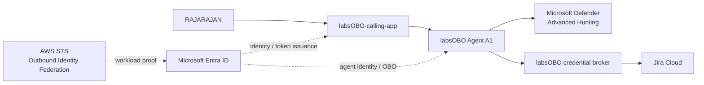
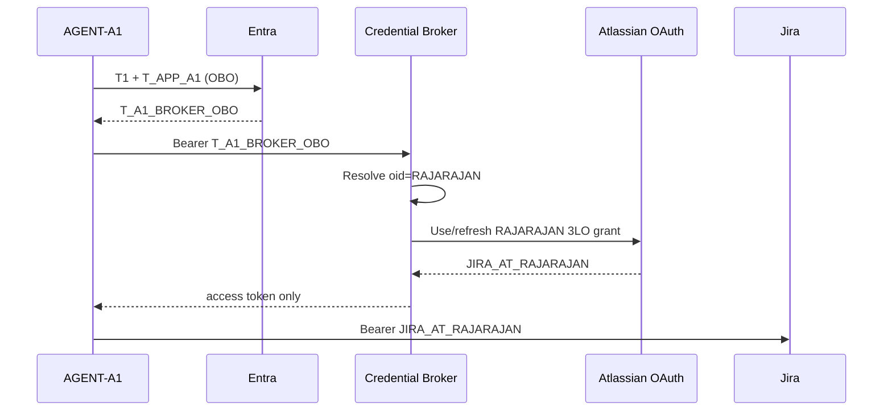
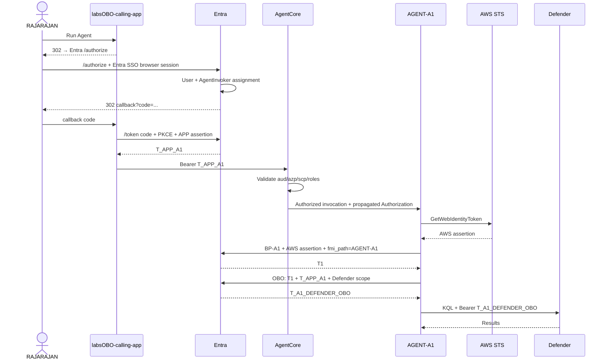
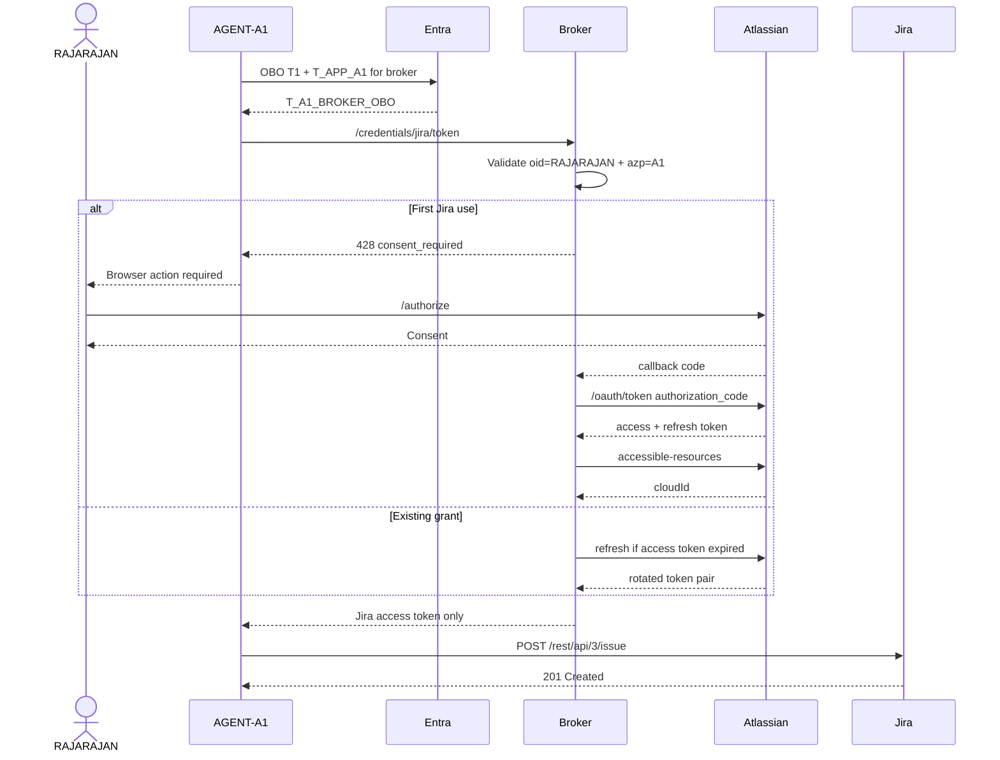

# labsOBO — End-to-End Agent Identity, User Authorization, OBO, Defender, and Jira Lab

> **Audience:** developer starting from a clean workstation  
> **Goal:** reproduce the `labsOBO` experiment and understand every identity/token hop  
> **Primary proof:** preserve a signed human identity across an application → agent → downstream API chain while independently proving the executing agent identity  
> **Lab user:** `RAJARAJAN`  
> **Updated:** 2026-09-09

---

## 0. What this lab proves

| Test | Question | Proof |
|---|---|---|
| 1 | Who is the human? | Entra user `oid` |
| 2 | Is this human entitled to invoke this agent? | `labsOBO.AgentInvoker` app-role assignment |
| 3 | Which application invoked the agent? | `azp = labsOBO-calling-app` |
| 4 | When A1 calls downstream, can the token preserve the human **and** identify A1 as actor? | Agent OBO token: human `oid` + agent `azp` |

```text
AUTHENTICATION
Who is the human?
        ↓
RAJARAJAN

AUTHORIZATION
May this human invoke A1?
        ↓
RAJARAJAN → labsOBO.AgentInvoker → BP-A1

AGENT IDENTITY
Which workload is executing?
        ↓
labsOBO Agent A1

DELEGATION / OBO
Who is A1 acting for downstream?
        ↓
RAJARAJAN
```

---

# 1. Target architecture



### Downstream operating modes

```text
DEFENDER PATH USED IN THE MAIN LAB
----------------------------------
RAJARAJAN → APP → A1 → Defender
                    ^
                    |
              OBO RAJARAJAN

Downstream Defender token:
oid = RAJARAJAN
azp = AGENT-A1
scp = AdvancedHunting.Read


JIRA PATH
---------
RAJARAJAN → APP → A1 → Entra OBO → Broker
                                      |
                               Atlassian 3LO grant
                                      |
                                      v
                                     Jira

Entra proves:
user = RAJARAJAN
actor = AGENT-A1

Atlassian proves:
Jira authority = RAJARAJAN
```

---

# 2. Important definitions

| Term | Meaning in this lab |
|---|---|
| `labsOBO-calling-app` | Confidential web/BFF application used by the human |
| `BP-A1` | `labsOBO-agent1-blueprint`; Entra Agent Identity Blueprint and inbound OAuth resource boundary |
| `AGENT-A1` | Child Entra Agent Identity representing the executing A1 agent |
| AgentCore Runtime | AWS runtime hosting A1 |
| `T_APP_A1` | Delegated Entra access token sent from application to AgentCore/A1 |
| AWS workload assertion | AWS STS-signed JWT proving the AgentCore execution IAM principal |
| `T1` | Entra token that allows child `AGENT-A1` to authenticate without holding its own secret/certificate |
| `T_A1_DEFENDER_OBO` | Delegated Defender token: RAJARAJAN is subject; A1 is actor |
| Broker | Application-owned credential service that verifies Entra OBO tokens and manages Atlassian tokens |
| `JIRA_AT_RAJARAJAN` | Atlassian access token delegated by RAJARAJAN |
| `JIRA_RT_RAJARAJAN` | Atlassian rotating refresh token; stays in broker vault |

---

# 3. Known values from the `labsOBO` test

```bash
export LABSOBO_TENANT_ID="a3430156-893d-4661-9dad-dce8308b8c21"

export LABSOBO_CALLING_APP_NAME="labsOBO-calling-app"
export LABSOBO_CALLING_APP_CLIENT_ID="05d1bf77-a2e4-4c1c-9ef1-31dff291dd45"

export LABSOBO_BP_A1_NAME="labsOBO-agent1-blueprint"
export LABSOBO_BP_A1_CLIENT_ID="5e5c2e3c-35b8-4817-8dc9-96b09adb6865"

export LABSOBO_ACCESS_SCOPE="labsOBO_access_agent"
export LABSOBO_AGENT_INVOKER_ROLE="labsOBO.AgentInvoker"

export LABSOBO_RAJARAJAN_USER_OBJECT_ID="2faa25c9-590d-4723-aebb-f39f819ce489"

export LABSOBO_REDIRECT_URI="http://localhost:3100/auth/callback"
```

Values to capture during provisioning:

```bash
export LABSOBO_BP_A1_OBJECT_ID="<application-object-id>"
export LABSOBO_BP_A1_PRINCIPAL_ID="<blueprint-principal-object-id>"

export LABSOBO_AGENT_A1_NAME="labsOBO-agent1"
export LABSOBO_AGENT_A1_CLIENT_ID="<agent-identity-app-id>"
export LABSOBO_AGENT_A1_OBJECT_ID="<agent-identity-service-principal-object-id>"

export LABSOBO_AGENT_INVOKER_ROLE_ID="<guid>"

export LABSOBO_AWS_ACCOUNT_ID="<aws-account-id>"
export LABSOBO_AWS_REGION="us-east-1"
export LABSOBO_A1_EXECUTION_ROLE_NAME="labsOBO-agent1-execution-role"
export LABSOBO_A1_EXECUTION_ROLE_ARN="arn:aws:iam::<account>:role/labsOBO-agent1-execution-role"
export LABSOBO_AWS_OIDC_ISSUER="<https://...tokens.sts.global.api.aws>"

export LABSOBO_AGENTCORE_RUNTIME_ID="<runtime-id>"
export LABSOBO_AGENTCORE_RUNTIME_ARN="<runtime-arn>"
export LABSOBO_AGENTCORE_INVOKE_URL="<runtime invoke URL>"

export LABSOBO_BROKER_CLIENT_ID="<broker-resource-app-id>"

export LABSOBO_ATLASSIAN_CLIENT_ID="<atlassian-3lo-client-id>"
export LABSOBO_ATLASSIAN_CALLBACK="http://localhost:3100/oauth/jira/callback"
```

> Tenant IDs, client IDs, object IDs, and role IDs are identifiers, not secrets.  
> Private keys, client secrets, authorization codes, access tokens, refresh tokens, and AWS temporary credentials are sensitive.

---

# 4. Official references

## Microsoft Entra Agent ID

- Agent ID documentation  
  https://learn.microsoft.com/en-us/entra/agent-id/

- Create an Agent Identity Blueprint  
  https://learn.microsoft.com/en-us/entra/agent-id/create-blueprint

- Create Agent Identities  
  https://learn.microsoft.com/en-us/entra/agent-id/create-delete-agent-identities

- Control user access to agents — app roles and `assignmentRequired`  
  https://learn.microsoft.com/en-us/entra/agent-id/control-user-access-agents

- Agent OAuth — On-Behalf-Of flow  
  https://learn.microsoft.com/en-us/entra/agent-id/agent-on-behalf-of-oauth-flow

- Autonomous/app-only Agent OAuth flow  
  https://learn.microsoft.com/en-us/entra/agent-id/agent-autonomous-app-oauth-flow

- Configure inheritable permissions  
  https://learn.microsoft.com/en-us/entra/agent-id/configure-inheritable-permissions-blueprints

- Agent identities, service principals, applications  
  https://learn.microsoft.com/en-us/entra/agent-id/identity-platform/agent-service-principals

## Microsoft identity platform

- OAuth 2.0 authorization code flow  
  https://learn.microsoft.com/en-us/entra/identity-platform/v2-oauth2-auth-code-flow

- Certificate client assertions  
  https://learn.microsoft.com/en-us/entra/identity-platform/certificate-credentials

- Workload Identity Federation  
  https://learn.microsoft.com/en-us/entra/workload-id/workload-identity-federation

## AWS

- AgentCore inbound JWT authorizer  
  https://docs.aws.amazon.com/bedrock-agentcore/latest/devguide/inbound-jwt-authorizer.html

- AgentCore OAuth/inbound/outbound authentication  
  https://docs.aws.amazon.com/bedrock-agentcore/latest/devguide/runtime-oauth.html

- AgentCore request-header allowlist  
  https://docs.aws.amazon.com/bedrock-agentcore/latest/devguide/runtime-header-allowlist.html

- AWS outbound identity federation  
  https://docs.aws.amazon.com/IAM/latest/UserGuide/id_roles_providers_outbound_getting_started.html

- `GetWebIdentityToken`  
  https://docs.aws.amazon.com/STS/latest/APIReference/API_GetWebIdentityToken.html

- AWS outbound token claims  
  https://docs.aws.amazon.com/IAM/latest/UserGuide/id_roles_providers_outbound_token_claims.html

## Defender

- Microsoft Defender XDR Advanced Hunting API  
  https://learn.microsoft.com/en-us/defender-xdr/api-advanced-hunting

## Atlassian

- Jira OAuth 2.0 authorization-code / 3LO flow  
  https://developer.atlassian.com/cloud/jira/service-desk/oauth-2-authorization-code-grants-3lo-for-apps/

- Jira OAuth 2.0 3LO overview  
  https://developer.atlassian.com/cloud/jira/software/oauth-2-3lo-apps/

---

# 5. Local workstation prerequisites

The PC is the **development/control machine**. A1 ultimately runs in AWS AgentCore.

Required:

```text
Git
Python 3.11+
curl
jq
OpenSSL
AWS CLI v2
PowerShell 7
Microsoft Graph PowerShell
```

Python environment:

```bash
mkdir labsOBO
cd labsOBO

python3 -m venv .venv
source .venv/bin/activate

pip install \
  flask \
  requests \
  pyjwt \
  cryptography \
  boto3 \
  python-dotenv
```

Microsoft Graph PowerShell:

```powershell
Install-Module Microsoft.Graph -Scope CurrentUser
```

Validate:

```bash
python --version
aws --version
jq --version
openssl version
pwsh --version
```

---

# 6. Recommended repository structure

```text
labsOBO/
├── README.md
├── .env.example
├── .gitignore
├── app/
│   ├── server.py
│   ├── entra.py
│   ├── pkce.py
│   └── templates/
├── agent/
│   ├── main.py
│   ├── auth.py
│   ├── defender.py
│   └── jira.py
├── broker/
│   ├── server.py
│   ├── token_validation.py
│   └── vault.py
├── scripts/
│   ├── decode_jwt.py
│   ├── make_client_assertion.py
│   ├── get_aws_assertion.py
│   └── smoke_test.sh
└── infra/
    ├── aws/
    │   ├── execution-role-policy.json
    │   └── agentcore-config.json
    └── entra/
        └── notes.md
```

`.gitignore`:

```gitignore
.env
*.pem
*.key
*.pfx
*.crt
tokens/
__pycache__/
.venv/
```

---

# 7. Phase 0 — Define the four trust statements

```text
TRUST 1 — USER → AGENT
RAJARAJAN is explicitly assigned:
labsOBO.AgentInvoker → BP-A1

TRUST 2 — APP → AGENT BOUNDARY
Only labsOBO-calling-app may present the inbound user token.

TRUST 3 — AWS WORKLOAD → BP-A1
BP-A1 has a Federated Identity Credential trusting the exact AgentCore execution role.

TRUST 4 — AGENT → DOWNSTREAM API
Entra issues a downstream token only after validating:
T1 + T_APP_A1
```

Do not collapse these into one permission.

---

# 8. Phase 1 — Register `labsOBO-calling-app`

## 8.1 Portal

```text
Microsoft Entra admin center
→ Entra ID
→ App registrations
→ New registration
```

Use:

```text
Name:
labsOBO-calling-app

Supported account types:
Single tenant

Redirect URI:
Web
http://localhost:3100/auth/callback
```

Known app ID:

```bash
export LABSOBO_CALLING_APP_CLIENT_ID="05d1bf77-a2e4-4c1c-9ef1-31dff291dd45"
```

## 8.2 Choose app authentication

```text
Preferred:
certificate / private_key_jwt

Temporary lab alternative:
client secret
```

Production preference:

```text
certificate / workload identity
>
client secret
```

## 8.3 Generate a local development certificate

```bash
mkdir -p certs

openssl req \
  -x509 \
  -newkey rsa:3072 \
  -keyout certs/labsOBO-calling-app.key \
  -out certs/labsOBO-calling-app.crt \
  -days 30 \
  -nodes \
  -subj "/CN=labsOBO-calling-app"
```

Upload only:

```text
certs/labsOBO-calling-app.crt
```

Portal:

```text
App registrations
→ labsOBO-calling-app
→ Certificates & secrets
→ Certificates
→ Upload certificate
```

Never upload the private key.

---

# 9. Phase 2 — Create the Agent Identity Blueprint `BP-A1`

## 9.1 Portal route

```text
Entra ID
→ Agents
→ Agent blueprints
→ New agent blueprint
```

Name:

```text
labsOBO-agent1-blueprint
```

Add owner/sponsor.

The wizard creates the blueprint and its blueprint principal.

Record:

```text
Blueprint Application / Client ID
Blueprint application Object ID
Blueprint principal Object ID
```

Known client ID:

```bash
LABSOBO_BP_A1_CLIENT_ID="5e5c2e3c-35b8-4817-8dc9-96b09adb6865"
```

## 9.2 Programmatic blueprint creation

Required Graph scopes include:

```text
AgentIdentityBlueprint.Create
AgentIdentityBlueprint.AddRemoveCreds.All
AgentIdentityBlueprint.UpdateAuthProperties.All
AgentIdentityBlueprintPrincipal.Create
User.Read
```

Connect:

```powershell
Connect-MgGraph `
  -TenantId "a3430156-893d-4661-9dad-dce8308b8c21" `
  -Scopes `
    "AgentIdentityBlueprint.Create", `
    "AgentIdentityBlueprint.AddRemoveCreds.All", `
    "AgentIdentityBlueprint.UpdateAuthProperties.All", `
    "AgentIdentityBlueprintPrincipal.Create", `
    "User.Read"
```

HTTP model:

```http
POST https://graph.microsoft.com/v1.0/applications/
OData-Version: 4.0
Authorization: Bearer <GRAPH_TOKEN>
Content-Type: application/json
```

```json
{
  "@odata.type": "Microsoft.Graph.AgentIdentityBlueprint",
  "displayName": "labsOBO-agent1-blueprint",
  "sponsors@odata.bind": [
    "https://graph.microsoft.com/v1.0/users/<SPONSOR_OBJECT_ID>"
  ],
  "owners@odata.bind": [
    "https://graph.microsoft.com/v1.0/users/<OWNER_OBJECT_ID>"
  ]
}
```

---

# 10. Phase 3 — Expose BP-A1 as the inbound OAuth resource

The user is not consenting to a human-like agent identity object.

The inbound protected resource is:

```text
BP-A1 API boundary
api://<BP-A1-client-id>
```

Expose:

```text
scope:
labsOBO_access_agent
```

Conceptual configuration:

```json
{
  "identifierUris": [
    "api://5e5c2e3c-35b8-4817-8dc9-96b09adb6865"
  ],
  "api": {
    "oauth2PermissionScopes": [
      {
        "adminConsentDescription": "Allow the application to invoke labsOBO Agent A1 on behalf of the signed-in user.",
        "adminConsentDisplayName": "Invoke labsOBO Agent A1",
        "id": "<SCOPE_GUID>",
        "isEnabled": true,
        "type": "User",
        "value": "labsOBO_access_agent"
      }
    ]
  }
}
```

Requested scope:

```text
api://5e5c2e3c-35b8-4817-8dc9-96b09adb6865/labsOBO_access_agent
```

---

# 11. Phase 4 — Create the human → agent authorization relationship

This answers:

```text
Who says RAJARAJAN may invoke A1?
```

Answer:

```text
Entra app-role assignment
```

## 11.1 Create app role on BP-A1

```text
Display name:
labsOBO Agent Invoker

Value:
labsOBO.AgentInvoker

Allowed member type:
Users/Groups

Description:
Allows an explicitly assigned human to invoke labsOBO Agent A1
```

Role model:

```json
{
  "id": "<LABSOBO_AGENT_INVOKER_ROLE_ID>",
  "allowedMemberTypes": ["User"],
  "description": "Allows assigned users to invoke labsOBO Agent A1",
  "displayName": "labsOBO Agent Invoker",
  "isEnabled": true,
  "value": "labsOBO.AgentInvoker"
}
```

## 11.2 Enforce assignment

Set:

```text
appRoleAssignmentRequired = true
```

Expected authorization:

```text
RAJARAJAN assigned      → may invoke
SAM not assigned        → denied
```

Reference:

```text
https://learn.microsoft.com/en-us/entra/agent-id/control-user-access-agents
```

## 11.3 Assign RAJARAJAN

Known user Object ID:

```bash
LABSOBO_RAJARAJAN_USER_OBJECT_ID="2faa25c9-590d-4723-aebb-f39f819ce489"
```

Graph request:

```http
POST https://graph.microsoft.com/v1.0/users/2faa25c9-590d-4723-aebb-f39f819ce489/appRoleAssignments
Authorization: Bearer <GRAPH_ADMIN_TOKEN>
Content-Type: application/json
```

```json
{
  "principalId": "2faa25c9-590d-4723-aebb-f39f819ce489",
  "resourceId": "<LABSOBO_BP_A1_PRINCIPAL_ID>",
  "appRoleId": "<LABSOBO_AGENT_INVOKER_ROLE_ID>"
}
```

Final directory relationship:

```text
RAJARAJAN
    |
    | appRoleAssignment
    | labsOBO.AgentInvoker
    v
BP-A1
```

## 11.4 Negative-control user

Use a second test user:

```text
SAM
```

Do not assign `labsOBO.AgentInvoker`.

Expected:

```text
RAJARAJAN → BP-A1 = allowed
SAM       → BP-A1 = denied
```

---

# 12. Phase 5 — Give calling app delegated permission to BP-A1

Portal:

```text
App registrations
→ labsOBO-calling-app
→ API permissions
→ Add a permission
→ My APIs
→ labsOBO-agent1-blueprint
→ Delegated permissions
→ labsOBO_access_agent
```

Prefer admin consent for the enterprise lab so the experiment tests **role assignment**, not the user's ability to grant OAuth consent.

| Control | Question |
|---|---|
| OAuth consent | May the client request/use this delegated API permission? |
| App role | May this human invoke this agent? |
| `assignmentRequired` | Is explicit assignment mandatory? |

---

# 13. Phase 6 — Create child Agent Identity `AGENT-A1`

## 13.1 Portal

```text
Entra ID
→ Agents
→ Agent identities
→ New agent identity
```

Select:

```text
Agent blueprint:
labsOBO-agent1-blueprint

Agent identity name:
labsOBO-agent1
```

Record:

```bash
LABSOBO_AGENT_A1_CLIENT_ID="<client-id>"
LABSOBO_AGENT_A1_OBJECT_ID="<object-id>"
```

## 13.2 Programmatic model

Current Microsoft documentation uses:

```http
POST https://graph.microsoft.com/beta/serviceprincipals/Microsoft.Graph.AgentIdentity
OData-Version: 4.0
Content-Type: application/json
Authorization: Bearer <token>
```

```json
{
  "displayName": "labsOBO-agent1",
  "agentIdentityBlueprintId": "<LABSOBO_BP_A1_CLIENT_ID>",
  "sponsors@odata.bind": [
    "https://graph.microsoft.com/v1.0/users/<SPONSOR_ID>"
  ]
}
```

> Agent identity creation is shown with a Microsoft Graph `beta` endpoint in the current Microsoft documentation. Re-check the official API before automating production provisioning.

---

# 14. Phase 7 — Local calling app endpoints

Run local app at:

```text
http://localhost:3100
```

Suggested endpoints:

```text
GET  /
POST /run-agent
GET  /auth/callback
GET  /oauth/jira/callback
POST /credentials/jira/token
```

---

# 15. Phase 8 — PKCE setup

Create verifier:

```bash
export LABSOBO_PKCE_VERIFIER="$(
  openssl rand -base64 64 |
  tr -d '=+/' |
  cut -c1-64
)"
```

Create challenge:

```bash
export LABSOBO_PKCE_CHALLENGE="$(
  printf '%s' "${LABSOBO_PKCE_VERIFIER}" |
  openssl dgst -binary -sha256 |
  openssl base64 -A |
  tr '+/' '-_' |
  tr -d '='
)"
```

Keep the verifier server-side in the login transaction/session.

---

# 16. Phase 9 — STEP 1 runtime: user → APP → BP-A1/A1

## Hop 1.1 — RAJARAJAN is already logged into the application

Application session:

```text
app_session = abc123
```

Server-side session:

```json
{
  "session": "abc123",
  "user_oid": "2faa25c9-590d-4723-aebb-f39f819ce489",
  "display_name": "RAJARAJAN"
}
```

Do not do this:

```text
APP → Entra: oid=RAJARAJAN, trust me
```

Entra independently identifies the browser session.

## Hop 1.2 — Human clicks `Run Agent`

```http
POST /run-agent HTTP/1.1
Host: localhost:3100
Cookie: app_session=abc123
```

APP returns a redirect to Entra.

## Hop 1.3 — Browser is sent to `/authorize`

Authorization endpoint:

```text
https://login.microsoftonline.com/a3430156-893d-4661-9dad-dce8308b8c21/oauth2/v2.0/authorize
```

Parameters:

```text
client_id=05d1bf77-a2e4-4c1c-9ef1-31dff291dd45
response_type=code
redirect_uri=http://localhost:3100/auth/callback
response_mode=query
scope=openid profile offline_access api://5e5c2e3c-35b8-4817-8dc9-96b09adb6865/labsOBO_access_agent
code_challenge=<PKCE_CHALLENGE>
code_challenge_method=S256
state=<RANDOM_STATE>
```

Equivalent request construction:

```bash
curl -G \
  "https://login.microsoftonline.com/${LABSOBO_TENANT_ID}/oauth2/v2.0/authorize" \
  --data-urlencode "client_id=${LABSOBO_CALLING_APP_CLIENT_ID}" \
  --data-urlencode "response_type=code" \
  --data-urlencode "redirect_uri=${LABSOBO_REDIRECT_URI}" \
  --data-urlencode "response_mode=query" \
  --data-urlencode "scope=openid profile offline_access api://${LABSOBO_BP_A1_CLIENT_ID}/${LABSOBO_ACCESS_SCOPE}" \
  --data-urlencode "code_challenge=${LABSOBO_PKCE_CHALLENGE}" \
  --data-urlencode "code_challenge_method=S256" \
  --data-urlencode "state=labsOBO-state-001"
```

### Browser rule

The actual flow is:

```text
APP
 |
 | HTTP 302
 v
Browser
 |
 | GET login.microsoftonline.com/.../authorize
 | + browser's existing Entra SSO cookie
 v
Entra
```

The APP does **not** read or forward Microsoft's SSO cookie.

## Hop 1.4 — Entra identifies RAJARAJAN

```text
authenticated Entra browser session
        ↓
RAJARAJAN
        ↓
oid = 2faa25c9-590d-4723-aebb-f39f819ce489
```

Entra evaluates:

```text
Requested resource:
BP-A1

Requested scope:
labsOBO_access_agent

assignmentRequired:
true

App-role assignment:
RAJARAJAN → labsOBO.AgentInvoker → BP-A1

Result:
ALLOW
```

## Hop 1.5 — Consent

First-time consent can appear if:

```text
permission requires consent
AND
consent has not been granted
AND
tenant policy allows the human to grant it
```

Observed consent wording included:

```text
labsOBO-calling-app

Invoke labsOBO Agent A1 on your behalf
View your basic profile
Maintain access to data you have given it access to
```

Keep separate:

```text
CONSENT
APP may request/use delegated permission
```

vs.

```text
ENTITLEMENT
RAJARAJAN may invoke BP-A1
```

For the cleanest lab:

```text
Admin consent = already granted
Role assignment = controls who may access A1
```

## Hop 1.6 — Entra returns authorization code

```http
HTTP/1.1 302 Found
Location: http://localhost:3100/auth/callback?code=<LABSOBO_AUTH_CODE>&state=labsOBO-state-001
```

Browser follows:

```http
GET /auth/callback?code=<LABSOBO_AUTH_CODE>&state=labsOBO-state-001 HTTP/1.1
Host: localhost:3100
```

Use:

```bash
export LABSOBO_RAJARAJAN_AUTH_CODE="<code>"
```

The code is:

```text
single-use
short-lived
bound to the OAuth transaction
not an access token
```

---

# 17. Phase 10 — Create `labsOBO-calling-app` client assertion

The backend creates this JWT.

```text
Authorization code → proves user authorization transaction
Client assertion   → proves confidential calling application
```

Header:

```json
{
  "alg": "PS256",
  "typ": "JWT",
  "x5t#S256": "<certificate-sha256-thumbprint>"
}
```

Payload:

```json
{
  "aud": "https://login.microsoftonline.com/a3430156-893d-4661-9dad-dce8308b8c21/oauth2/v2.0/token",
  "iss": "05d1bf77-a2e4-4c1c-9ef1-31dff291dd45",
  "sub": "05d1bf77-a2e4-4c1c-9ef1-31dff291dd45",
  "jti": "<random-guid>",
  "nbf": "<now>",
  "exp": "<now+300s>"
}
```

Sign with:

```text
certs/labsOBO-calling-app.key
```

Entra verifies against the public certificate registered on the app.

---

# 18. Phase 11 — Exchange authorization code for `T_APP_A1`

```bash
curl -X POST \
  "https://login.microsoftonline.com/a3430156-893d-4661-9dad-dce8308b8c21/oauth2/v2.0/token" \
  -H "Content-Type: application/x-www-form-urlencoded" \
  --data-urlencode "grant_type=authorization_code" \
  --data-urlencode "client_id=05d1bf77-a2e4-4c1c-9ef1-31dff291dd45" \
  --data-urlencode "code=${LABSOBO_RAJARAJAN_AUTH_CODE}" \
  --data-urlencode "redirect_uri=http://localhost:3100/auth/callback" \
  --data-urlencode "code_verifier=${LABSOBO_PKCE_VERIFIER}" \
  --data-urlencode "scope=openid profile offline_access api://5e5c2e3c-35b8-4817-8dc9-96b09adb6865/labsOBO_access_agent" \
  --data-urlencode "client_assertion_type=urn:ietf:params:oauth:client-assertion-type:jwt-bearer" \
  --data-urlencode "client_assertion=${LABSOBO_CALLING_APP_ASSERTION}"
```

Expected:

```json
{
  "token_type": "Bearer",
  "scope": "labsOBO_access_agent",
  "expires_in": 3599,
  "access_token": "<LABSOBO_T_APP_A1>",
  "refresh_token": "<if issued>"
}
```

---

# 19. Phase 12 — Inspect observed `T_APP_A1`

Observed representation:

```text
eyJ0eXAiOiJKV1QiLCJhbGciOiJSUzI1NiIsImtpZCI6IlQ1aDQwcTdHMHg0OXFuNDFsTTkta0tqcEQ5OCJ9.
eyJhdWQiOiI1ZTVjMmUzYy0zNWI4LTQ4MTctOGRjOS05NmIwOWFkYjY4NjUiLCJpc3MiOiJodHRwczovL2xvZ2luLm1pY3Jvc29mdG9ubGluZS5jb20v…
⟨payload 1252⟩.
⟨signature 342⟩
```

Observed claims:

| Claim | Observed value | What it proves |
|---|---|---|
| `oid` | `2faa25c9-590d-4723-aebb-f39f819ce489` | Human is RAJARAJAN |
| `azp` | `05d1bf77-a2e4-4c1c-9ef1-31dff291dd45` | OAuth client is `labsOBO-calling-app` |
| `aud` | `5e5c2e3c-35b8-4817-8dc9-96b09adb6865` | Token is intended for BP-A1 |
| `scp` | `labsOBO_access_agent` | Delegated agent-invocation scope |
| `roles` | `['labsOBO.AgentInvoker']` | Human is explicitly entitled to invoke A1 |

### Audience rule

Use the **actual token claim** in the AgentCore authorizer.

Observed `aud`:

```text
5e5c2e3c-35b8-4817-8dc9-96b09adb6865
```

Do not assume it will always render as:

```text
api://5e5c2e3c-35b8-4817-8dc9-96b09adb6865
```

---

# 20. Phase 13 — Negative test with SAM

Repeat the same OAuth flow with SAM.

Keep identical:

```text
calling app
BP-A1
scope
redirect URI
authorization flow
```

Change only:

```text
user = SAM
```

With `assignmentRequired=true` and no role assignment:

```text
SAM → labsOBO.AgentInvoker → BP-A1
```

Expected:

```text
SAM cannot obtain/use the same authorized agent-invocation context.
```

This proves the application is not the user→agent mapping.

---

# 21. Phase 14 — Deploy A1 to AgentCore

Create AgentCore runtime:

```text
Name:
labsOBO-agent1-runtime

Execution role:
labsOBO-agent1-execution-role
```

Runtime config:

```text
LABSOBO_TENANT_ID
LABSOBO_BP_A1_CLIENT_ID
LABSOBO_AGENT_A1_CLIENT_ID
LABSOBO_BROKER_CLIENT_ID
```

These are configuration values, not credentials.

---

# 22. Phase 15 — Configure AgentCore inbound JWT authorization

Discovery URL:

```text
https://login.microsoftonline.com/a3430156-893d-4661-9dad-dce8308b8c21/v2.0/.well-known/openid-configuration
```

Recommended checks:

```text
aud
= exact observed BP-A1 audience

azp
= 05d1bf77-a2e4-4c1c-9ef1-31dff291dd45

scp
contains labsOBO_access_agent

roles
contains labsOBO.AgentInvoker
```

Conceptual AgentCore configuration:

```json
{
  "customJWTAuthorizer": {
    "discoveryUrl": "https://login.microsoftonline.com/a3430156-893d-4661-9dad-dce8308b8c21/v2.0/.well-known/openid-configuration",
    "allowedAudience": [
      "5e5c2e3c-35b8-4817-8dc9-96b09adb6865"
    ],
    "allowedScopes": [
      "labsOBO_access_agent"
    ],
    "customClaims": [
      {
        "inboundTokenClaimName": "azp",
        "inboundTokenClaimValueType": "STRING",
        "authorizingClaimMatchValue": {
          "claimMatchOperator": "EQUALS",
          "claimMatchValue": {
            "matchValueString": "05d1bf77-a2e4-4c1c-9ef1-31dff291dd45"
          }
        }
      },
      {
        "inboundTokenClaimName": "roles",
        "inboundTokenClaimValueType": "STRING_ARRAY",
        "authorizingClaimMatchValue": {
          "claimMatchOperator": "CONTAINS",
          "claimMatchValue": {
            "matchValueString": "labsOBO.AgentInvoker"
          }
        }
      }
    ]
  }
}
```

### Why custom `azp`?

AgentCore's built-in `allowedClients` check is documented against a `client_id` claim.

The observed Entra token uses:

```text
azp
```

Therefore use custom-claim validation for `azp` unless the issued token contains the built-in claim AgentCore expects.

---

# 23. Phase 16 — Allow inbound token to reach A1 code

A1 needs `T_APP_A1` later for OBO.

Allowlist:

```text
Authorization
```

Inside A1:

```python
@app.entrypoint
def invoke(payload, context):
    auth_header = context.request_headers.get("Authorization")

    if not auth_header:
        raise RuntimeError("Missing propagated Authorization header")

    t_app_a1 = auth_header.removeprefix("Bearer ").strip()
```

AgentCore has already performed inbound JWT authorization; A1 may decode claims for context/telemetry without using that decode as a substitute for the runtime's validation.

---

# 24. Phase 17 — APP invokes AgentCore

```bash
curl -X POST \
  "${LABSOBO_AGENTCORE_INVOKE_URL}" \
  -H "Authorization: Bearer ${LABSOBO_T_APP_A1}" \
  -H "Content-Type: application/json" \
  -d '{
    "workflow_id": "labsOBO-WF-9281",
    "prompt": "Analyze Defender for suspicious PowerShell activity"
  }'
```

AgentCore checks:

```text
signature valid             ✓
issuer trusted              ✓
token not expired           ✓
aud = BP-A1                 ✓
azp = labsOBO-calling-app   ✓
scp = labsOBO_access_agent  ✓
roles contains AgentInvoker ✓
```

Only then A1 executes.

Trace context:

```json
{
  "workflow_id": "labsOBO-WF-9281",
  "initiating_user_oid": "2faa25c9-590d-4723-aebb-f39f819ce489",
  "calling_client": "05d1bf77-a2e4-4c1c-9ef1-31dff291dd45"
}
```

---

# 25. Phase 18 — Configure AWS → Entra workload federation

This proves the runtime workload.

## 25.1 Enable AWS outbound web identity federation

One-time AWS-account operation:

```bash
aws iam enable-outbound-web-identity-federation
```

Verify/capture issuer:

```bash
aws iam get-outbound-web-identity-federation-info
```

Expected shape:

```json
{
  "IssuerIdentifier": "https://<unique-id>.tokens.sts.global.api.aws",
  "JwtVendingEnabled": true
}
```

Save:

```bash
export LABSOBO_AWS_OIDC_ISSUER="https://<unique-id>.tokens.sts.global.api.aws"
```

OIDC metadata:

```bash
curl "${LABSOBO_AWS_OIDC_ISSUER}/.well-known/openid-configuration" | jq
```

JWKS:

```bash
curl "${LABSOBO_AWS_OIDC_ISSUER}/.well-known/jwks.json" | jq
```

## 25.2 Give A1 execution role permission to mint outbound JWT

```json
{
  "Version": "2012-10-17",
  "Statement": [
    {
      "Effect": "Allow",
      "Action": "sts:GetWebIdentityToken",
      "Resource": "*",
      "Condition": {
        "ForAllValues:StringEquals": {
          "sts:IdentityTokenAudience": "api://AzureADTokenExchange"
        },
        "NumericLessThanEquals": {
          "sts:DurationSeconds": 300
        }
      }
    }
  ]
}
```

Attach to:

```text
labsOBO-agent1-execution-role
```

## 25.3 Configure Federated Identity Credential on BP-A1

```json
{
  "name": "labsOBO-agentcore-aws",
  "issuer": "<LABSOBO_AWS_OIDC_ISSUER>",
  "subject": "arn:aws:iam::<account>:role/labsOBO-agent1-execution-role",
  "audiences": [
    "api://AzureADTokenExchange"
  ]
}
```

Graph model:

```http
POST https://graph.microsoft.com/v1.0/applications/<BP-A1-APPLICATION-ID>/federatedIdentityCredentials
OData-Version: 4.0
Authorization: Bearer <GRAPH_TOKEN>
Content-Type: application/json
```

Entra requires exact case-sensitive matching:

```text
JWT iss == FIC issuer
JWT sub == FIC subject
JWT aud == FIC audience
```

Signature is verified through AWS OIDC JWKS.

---

# 26. Phase 19 — A1 obtains AWS workload assertion

A1 initiates:

```bash
aws sts get-web-identity-token \
  --region "${LABSOBO_AWS_REGION}" \
  --audience "api://AzureADTokenExchange" \
  --signing-algorithm RS256 \
  --duration-seconds 300
```

Boto3:

```python
import boto3

sts = boto3.client("sts", region_name="us-east-1")

resp = sts.get_web_identity_token(
    Audience=["api://AzureADTokenExchange"],
    SigningAlgorithm="RS256",
    DurationSeconds=300,
)

aws_assertion = resp["WebIdentityToken"]
```

Conceptual assertion:

```json
{
  "iss": "https://<aws-issuer>.tokens.sts.global.api.aws",
  "sub": "arn:aws:iam::<account>:role/labsOBO-agent1-execution-role",
  "aud": "api://AzureADTokenExchange",
  "iat": 1788,
  "exp": 1788
}
```

Meaning:

```text
AWS STS cryptographically certifies the calling IAM principal.
```

This is not AgentCore's opaque WorkloadAccessToken.

---

# 27. Phase 20 — Exchange AWS proof for `T1`

A1 code initiates this call. BP-A1 itself does not execute code.

```bash
curl -X POST \
  "https://login.microsoftonline.com/${LABSOBO_TENANT_ID}/oauth2/v2.0/token" \
  -H "Content-Type: application/x-www-form-urlencoded" \
  --data-urlencode "client_id=${LABSOBO_BP_A1_CLIENT_ID}" \
  --data-urlencode "grant_type=client_credentials" \
  --data-urlencode "scope=api://AzureADTokenExchange/.default" \
  --data-urlencode "client_assertion_type=urn:ietf:params:oauth:client-assertion-type:jwt-bearer" \
  --data-urlencode "client_assertion=${LABSOBO_AWS_ASSERTION}" \
  --data-urlencode "fmi_path=${LABSOBO_AGENT_A1_CLIENT_ID}"
```

Meaning:

| Parameter | Meaning |
|---|---|
| `client_id=BP-A1` | Which blueprint is authenticating? |
| `client_assertion=AWS assertion` | Prove this AWS workload is the principal BP-A1 trusts |
| `fmi_path=AGENT-A1` | Which child agent identity is this acquisition for? |

Entra validates:

```text
AWS assertion signature       ✓
issuer matches FIC            ✓
subject matches IAM role      ✓
audience matches FIC          ✓
client_id = BP-A1             ✓
fmi_path resolves AGENT-A1    ✓
```

Response:

```json
{
  "token_type": "Bearer",
  "expires_in": 3599,
  "access_token": "<LABSOBO_T1_A1>"
}
```

`T1` is not a Defender token.

```text
T1 = A1 authentication proof for the next Entra exchange
```

---

# 28. Phase 21 — Configure Defender delegated permission

Main experiment:

```text
Delegated permission:
AdvancedHunting.Read
```

Delegated Defender requirements:

```text
RAJARAJAN needs Defender "View Data" role.
RAJARAJAN needs access to relevant devices/device groups.
```

Reference:

```text
https://learn.microsoft.com/en-us/defender-xdr/api-advanced-hunting
```

## No runtime `/authorize` from A1

Use controlled enterprise authorization:

```text
Declare/grant delegated permission on blueprint.
Use inheritable/preauthorized permissions where appropriate.
Grant administrator consent ahead of runtime.
```

Reference:

```text
https://learn.microsoft.com/en-us/entra/agent-id/configure-inheritable-permissions-blueprints
```

---

# 29. Phase 22 — STEP 2: A1 → Defender OBO RAJARAJAN

A1 now holds:

```text
T_APP_A1
= user proof

T1
= agent proof
```

## Hop 2.1 — A1 sends OBO request

```bash
curl -X POST \
  "https://login.microsoftonline.com/${LABSOBO_TENANT_ID}/oauth2/v2.0/token" \
  -H "Content-Type: application/x-www-form-urlencoded" \
  --data-urlencode "client_id=${LABSOBO_AGENT_A1_CLIENT_ID}" \
  --data-urlencode "scope=<DEFENDER_RESOURCE>/AdvancedHunting.Read" \
  --data-urlencode "client_assertion_type=urn:ietf:params:oauth:client-assertion-type:jwt-bearer" \
  --data-urlencode "client_assertion=${LABSOBO_T1_A1}" \
  --data-urlencode "grant_type=urn:ietf:params:oauth:grant-type:jwt-bearer" \
  --data-urlencode "assertion=${LABSOBO_T_APP_A1}" \
  --data-urlencode "requested_token_use=on_behalf_of"
```

| Parameter | Meaning |
|---|---|
| `client_id=AGENT-A1` | A1 is the downstream actor |
| `client_assertion=T1` | Proves A1 |
| `assertion=T_APP_A1` | Carries RAJARAJAN human context |
| `requested_token_use=on_behalf_of` | Explicit OBO |
| Defender scope | Human-delegated downstream capability |

Microsoft Agent OBO expects:

```text
T_APP_A1 aud == BP-A1
T1 bound to BP-A1
T1 sub/FMI resolves to child AGENT-A1
```

## Hop 2.2 — Entra returns Defender OBO token

```bash
export LABSOBO_T_A1_DEFENDER_OBO="<access-token>"
```

Expected semantics:

```json
{
  "oid": "2faa25c9-590d-4723-aebb-f39f819ce489",
  "azp": "<LABSOBO_AGENT_A1_CLIENT_ID>",
  "idtyp": "user",
  "aud": "<Defender resource>",
  "scp": "AdvancedHunting.Read"
}
```

Transition:

```text
T_APP_A1
OID = RAJARAJAN
AZP = Calling App
AUD = BP-A1

        +

T1
Agent = A1

        ↓ OBO

T_A1_DEFENDER_OBO
OID = RAJARAJAN
AZP = Agent A1
AUD = Defender
SCP = AdvancedHunting.Read
```

Key result:

```text
Human preserved.
Actor changed.
```

---

# 30. Phase 23 — LLM creates KQL

Identity infrastructure does not decide the query.

Example human request:

```text
Analyze Defender for suspicious PowerShell activity in the last hour.
```

Tool contract:

```json
{
  "name": "run_defender_hunting_query",
  "description": "Execute a read-only Microsoft Defender Advanced Hunting KQL query.",
  "parameters": {
    "type": "object",
    "properties": {
      "query": {
        "type": "string"
      }
    },
    "required": ["query"]
  }
}
```

Possible LLM tool call:

```json
{
  "name": "run_defender_hunting_query",
  "arguments": {
    "query": "DeviceProcessEvents | where Timestamp > ago(1h) | where FileName =~ 'powershell.exe' | project Timestamp, DeviceName, AccountName, ProcessCommandLine | take 100"
  }
}
```

Responsibility split:

```text
LLM
→ proposes KQL

A1 host
→ validates KQL
→ obtains/uses token
→ executes HTTP call
→ returns tool result to LLM
```

Do not expose refresh tokens, app secrets, or AWS credentials to the LLM prompt/tool context.

---

# 31. Phase 24 — A1 calls Defender

```bash
curl -X POST \
  "https://api.security.microsoft.com/api/advancedhunting/run" \
  -H "Authorization: Bearer ${LABSOBO_T_A1_DEFENDER_OBO}" \
  -H "Content-Type: application/json" \
  -d '{
    "Query": "DeviceProcessEvents | where Timestamp > ago(1h) | where FileName =~ '\''powershell.exe'\'' | project Timestamp, DeviceName, AccountName, ProcessCommandLine | take 100"
  }'
```

Defender validates:

```text
token issuer/signature     ✓
audience                   ✓
delegated scope            ✓
RAJARAJAN View Data        ✓
RAJARAJAN device access    ✓
```

Example response:

```json
{
  "Stats": {
    "ExecutionTime": 0.42
  },
  "Results": [
    {
      "DeviceName": "SEC-LAPTOP-22",
      "AccountName": "john",
      "ProcessCommandLine": "powershell.exe -EncodedCommand ..."
    }
  ]
}
```

Audit meaning:

```text
RAJARAJAN initiated the chain.
AGENT-A1 is the downstream OAuth actor.
Defender evaluated delegated RAJARAJAN authority.
```

---

# 32. Phase 25 — Optional autonomous Defender comparison

Autonomous path:

```bash
curl -X POST \
  "https://login.microsoftonline.com/${LABSOBO_TENANT_ID}/oauth2/v2.0/token" \
  -H "Content-Type: application/x-www-form-urlencoded" \
  --data-urlencode "client_id=${LABSOBO_AGENT_A1_CLIENT_ID}" \
  --data-urlencode "scope=https://api.security.microsoft.com/.default" \
  --data-urlencode "client_assertion_type=urn:ietf:params:oauth:client-assertion-type:jwt-bearer" \
  --data-urlencode "client_assertion=${LABSOBO_T1_A1}" \
  --data-urlencode "grant_type=client_credentials"
```

Permission:

```text
AdvancedHunting.Read.All
Application
```

Token semantics:

```text
OID = AGENT-A1
AZP = AGENT-A1
idtyp = app
roles = AdvancedHunting.Read.All

NO RAJARAJAN
```

| Path | Defender authorization uses |
|---|---|
| Autonomous | A1 application permission |
| OBO | RAJARAJAN delegated permission |

---

# 33. Phase 26 — Jira architecture

Jira is a separate authorization domain.

Entra cannot directly mint:

```text
JIRA_AT_RAJARAJAN
```

Atlassian does not directly consume:

```text
T_APP_A1
T1
AGENT-A1 Entra identity
```

Broker joins both domains.



---

# 34. Phase 27 — Register Atlassian OAuth 2.0 / 3LO integration

Create:

```text
Name:
labsOBO-security-investigation-agent

Client:
LABSOBO_ATLASSIAN_CLIENT_ID

Callback:
http://localhost:3100/oauth/jira/callback
```

Lab scopes:

```text
write:jira-work
offline_access
```

Store client secret only in backend/broker secret storage.

A1 must never receive it.

---

# 35. Phase 28 — Register broker as Entra resource

Expose broker API scope, for example:

```text
api://<LABSOBO_BROKER_CLIENT_ID>/labsOBO_jira.create
```

Broker validates:

```text
issuer = trusted Entra tenant
aud = broker
oid = RAJARAJAN
azp = AGENT-A1
scp contains labsOBO_jira.create
agent identity allowed
```

---

# 36. Phase 29 — A1 obtains broker OBO token

```bash
curl -X POST \
  "https://login.microsoftonline.com/${LABSOBO_TENANT_ID}/oauth2/v2.0/token" \
  -H "Content-Type: application/x-www-form-urlencoded" \
  --data-urlencode "client_id=${LABSOBO_AGENT_A1_CLIENT_ID}" \
  --data-urlencode "scope=api://${LABSOBO_BROKER_CLIENT_ID}/labsOBO_jira.create" \
  --data-urlencode "client_assertion_type=urn:ietf:params:oauth:client-assertion-type:jwt-bearer" \
  --data-urlencode "client_assertion=${LABSOBO_T1_A1}" \
  --data-urlencode "grant_type=urn:ietf:params:oauth:grant-type:jwt-bearer" \
  --data-urlencode "assertion=${LABSOBO_T_APP_A1}" \
  --data-urlencode "requested_token_use=on_behalf_of"
```

Result:

```text
LABSOBO_T_A1_BROKER_OBO
```

Expected:

```json
{
  "oid": "2faa25c9-590d-4723-aebb-f39f819ce489",
  "azp": "<AGENT-A1-CLIENT-ID>",
  "aud": "<BROKER-RESOURCE-ID>",
  "scp": "labsOBO_jira.create"
}
```

---

# 37. Phase 30 — A1 asks broker for Jira token

```bash
curl -X POST \
  "http://localhost:3100/credentials/jira/token" \
  -H "Authorization: Bearer ${LABSOBO_T_A1_BROKER_OBO}" \
  -H "Content-Type: application/json" \
  -d '{
    "purpose": "create_issue",
    "project": "SEC",
    "workflow_id": "labsOBO-WF-9281",
    "trace_id": "labsOBO-TRACE-882"
  }'
```

Trusted identity comes from token:

```text
oid = RAJARAJAN
azp = AGENT-A1
```

Do not trust a request-body field like:

```json
{
  "user": "RAJARAJAN"
}
```

by itself.

---

# 38. Phase 31 — First Jira use: no grant in vault

Vault key:

```text
Entra tenant + RAJARAJAN oid + provider=Atlassian
```

If not found:

```http
HTTP/1.1 428 Precondition Required
Content-Type: application/json
```

```json
{
  "error": "consent_required",
  "provider": "atlassian",
  "workflow_id": "labsOBO-WF-9281",
  "authorization_url": "https://auth.atlassian.com/authorize?..."
}
```

A1 pauses workflow.

---

# 39. Phase 32 — Atlassian 3LO browser authorization

Create random state:

```text
labsOBO-atlassian-state-X92KA
```

Store server-side:

```json
{
  "state": "labsOBO-atlassian-state-X92KA",
  "entra_oid": "2faa25c9-590d-4723-aebb-f39f819ce489",
  "workflow_id": "labsOBO-WF-9281",
  "used": false,
  "expires_at": "<short-expiry>"
}
```

Authorization URL:

```bash
curl -G \
  "https://auth.atlassian.com/authorize" \
  --data-urlencode "audience=api.atlassian.com" \
  --data-urlencode "client_id=${LABSOBO_ATLASSIAN_CLIENT_ID}" \
  --data-urlencode "scope=write:jira-work offline_access" \
  --data-urlencode "redirect_uri=${LABSOBO_ATLASSIAN_CALLBACK}" \
  --data-urlencode "state=labsOBO-atlassian-state-X92KA" \
  --data-urlencode "response_type=code" \
  --data-urlencode "prompt=consent"
```

Actual operation:

```text
APP returns 302
Browser visits Atlassian
RAJARAJAN authenticates/SSOs
RAJARAJAN grants permission
Atlassian returns code to callback
```

---

# 40. Phase 33 — Atlassian callback

```http
HTTP/1.1 302 Found
Location: http://localhost:3100/oauth/jira/callback?code=<JIRA_CODE>&state=labsOBO-atlassian-state-X92KA
```

Broker checks:

```text
state exists        ✓
state unexpired     ✓
state unused        ✓
state belongs to RAJARAJAN application session ✓
workflow matches    ✓
```

This safely binds:

```text
Entra RAJARAJAN
        ↕
Atlassian authorization transaction
```

---

# 41. Phase 34 — Broker exchanges Atlassian code

```bash
curl -X POST \
  "https://auth.atlassian.com/oauth/token" \
  -H "Content-Type: application/json" \
  -d '{
    "grant_type": "authorization_code",
    "client_id": "'"${LABSOBO_ATLASSIAN_CLIENT_ID}"'",
    "client_secret": "'"${LABSOBO_ATLASSIAN_CLIENT_SECRET}"'",
    "code": "'"${LABSOBO_JIRA_AUTH_CODE}"'",
    "redirect_uri": "'"${LABSOBO_ATLASSIAN_CALLBACK}"'"
  }'
```

Expected:

```json
{
  "access_token": "<JIRA_AT_RAJARAJAN>",
  "refresh_token": "<JIRA_RT_RAJARAJAN>",
  "expires_in": 3600,
  "scope": "write:jira-work offline_access",
  "token_type": "Bearer"
}
```

---

# 42. Phase 35 — Discover Jira `cloudId`

```bash
curl \
  "https://api.atlassian.com/oauth/token/accessible-resources" \
  -H "Authorization: Bearer ${JIRA_AT_RAJARAJAN}" \
  -H "Accept: application/json"
```

Expected:

```json
[
  {
    "id": "<JIRA_CLOUD_ID>",
    "name": "Company Jira",
    "url": "https://company.atlassian.net",
    "scopes": [
      "write:jira-work"
    ]
  }
]
```

Store:

```text
entra_oid
atlassian_account_id if captured
cloud_id
access_token
refresh_token
scope
expiry
```

---

# 43. Phase 36 — Broker returns only short-lived Jira access token to A1

```json
{
  "access_token": "<JIRA_AT_RAJARAJAN>",
  "cloud_id": "<JIRA_CLOUD_ID>",
  "expires_in": 1200
}
```

Never return to A1:

```text
Atlassian client secret
JIRA_RT_RAJARAJAN
```

---

# 44. Phase 37 — A1 creates Jira issue

```bash
curl -X POST \
  "https://api.atlassian.com/ex/jira/${JIRA_CLOUD_ID}/rest/api/3/issue" \
  -H "Authorization: Bearer ${JIRA_AT_RAJARAJAN}" \
  -H "Accept: application/json" \
  -H "Content-Type: application/json" \
  -d '{
    "fields": {
      "project": {
        "key": "SEC"
      },
      "issuetype": {
        "name": "Incident"
      },
      "summary": "Suspicious encoded PowerShell activity detected",
      "description": {
        "type": "doc",
        "version": 1,
        "content": []
      }
    },
    "properties": [
      {
        "key": "labsOBO.agentProvenance",
        "value": {
          "agentId": "labsOBO-agent1",
          "initiatingUserOid": "2faa25c9-590d-4723-aebb-f39f819ce489",
          "workflowId": "labsOBO-WF-9281",
          "traceId": "labsOBO-TRACE-882",
          "source": "Microsoft Defender",
          "executionMode": "OBO"
        }
      }
    ]
  }'
```

Jira evaluates:

```text
Atlassian access token valid               ✓
OAuth integration valid                    ✓
RAJARAJAN grant includes write permission ✓
RAJARAJAN can browse project SEC           ✓
RAJARAJAN can create issues in SEC         ✓
```

---

# 45. Phase 38 — Jira token refresh

When access token expires:

```bash
curl -X POST \
  "https://auth.atlassian.com/oauth/token" \
  -H "Content-Type: application/json" \
  -d '{
    "grant_type": "refresh_token",
    "client_id": "'"${LABSOBO_ATLASSIAN_CLIENT_ID}"'",
    "client_secret": "'"${LABSOBO_ATLASSIAN_CLIENT_SECRET}"'",
    "refresh_token": "'"${JIRA_RT_RAJARAJAN}"'"
  }'
```

Rotating refresh behavior:

```text
old refresh token
      ↓ used
new access token
+
new refresh token
      ↓
replace old vault value atomically
```

---

# 46. Complete token-hop reference

| Token | Issuer | Human | Actor/client | Audience | Main control |
|---|---|---|---|---|---|
| `T_APP_A1` | Entra | RAJARAJAN | calling app | BP-A1 | `scp` + `labsOBO.AgentInvoker` |
| AWS assertion | AWS STS | none | AgentCore IAM role | AzureADTokenExchange | FIC issuer/sub/aud match |
| `T1` | Entra | none | BP-A1 → AGENT-A1 binding | token exchange | `fmi_path` |
| `T_A1_DEFENDER_OBO` | Entra | RAJARAJAN | AGENT-A1 | Defender | `AdvancedHunting.Read` |
| `T_A1_BROKER_OBO` | Entra | RAJARAJAN | AGENT-A1 | Broker | `labsOBO_jira.create` |
| `JIRA_AT_RAJARAJAN` | Atlassian | RAJARAJAN | Atlassian OAuth integration | Jira | scope + Jira native permissions |
| `JIRA_RT_RAJARAJAN` | Atlassian | RAJARAJAN | OAuth integration | token endpoint | offline access / rotating refresh |

---

# 47. Complete Defender OBO sequence



---

# 48. Complete Jira sequence



---

# 49. Audit model

Use one stable correlation record:

```json
{
  "workflow_id": "labsOBO-WF-9281",
  "trace_id": "labsOBO-TRACE-882",

  "initiating_user": {
    "tenant_id": "a3430156-893d-4661-9dad-dce8308b8c21",
    "oid": "2faa25c9-590d-4723-aebb-f39f819ce489"
  },

  "calling_application": {
    "azp": "05d1bf77-a2e4-4c1c-9ef1-31dff291dd45"
  },

  "agent": {
    "client_id": "<LABSOBO_AGENT_A1_CLIENT_ID>",
    "blueprint": "5e5c2e3c-35b8-4817-8dc9-96b09adb6865"
  },

  "defender": {
    "mode": "OBO",
    "query_hash": "<sha256>",
    "run_id": "<if available>"
  },

  "jira": {
    "mode": "OBO",
    "issue_key": "SEC-1234"
  }
}
```

Store token IDs/hashes where useful.

Do not store complete bearer tokens in normal logs.

---

# 50. Security checks before lab completion

## Inbound A1

```text
[ ] JWT signature validated by AgentCore
[ ] issuer is correct tenant
[ ] exact audience checked
[ ] azp equals allowed calling app
[ ] labsOBO_access_agent checked
[ ] labsOBO.AgentInvoker checked
[ ] role assignment required
[ ] Authorization propagation is intentional
```

## AWS federation

```text
[ ] outbound web identity federation enabled
[ ] GetWebIdentityToken limited to AzureADTokenExchange
[ ] token duration restricted
[ ] BP-A1 FIC issuer exact
[ ] BP-A1 FIC subject exact IAM role
[ ] BP-A1 FIC audience exact
[ ] no static AWS keys in container
```

## OBO

```text
[ ] T_APP_A1 audience = BP-A1
[ ] T1 belongs to BP-A1 + AGENT-A1
[ ] downstream delegated permission preauthorized/admin-consented
[ ] OBO response oid remains RAJARAJAN
[ ] OBO response actor/azp is AGENT-A1
```

## Jira

```text
[ ] Entra OBO token validated by broker
[ ] broker indexes identity by immutable tenant+oid
[ ] Atlassian state random, single-use, expiring, session-bound
[ ] Atlassian client secret stays in broker
[ ] refresh token stays in broker
[ ] rotating refresh token replaced atomically
[ ] only access token returned to A1
[ ] Jira native authorization remains authoritative
```

---

# 51. Mandatory negative tests

| ID | Test | Expected |
|---|---|---|
| T01 | RAJARAJAN assigned AgentInvoker | `T_APP_A1` / A1 invocation succeeds |
| T02 | SAM has no AgentInvoker | denied |
| T03 | Remove RAJARAJAN AgentInvoker and request new token | denied |
| T04 | Wrong `aud` sent to AgentCore | rejected |
| T05 | Wrong `azp` | rejected |
| T06 | Missing `labsOBO_access_agent` | rejected |
| T07 | Missing role claim | rejected |
| T08 | Expired `T_APP_A1` | rejected |
| T09 | AWS JWT from different IAM role | Entra FIC exchange fails |
| T10 | AWS assertion wrong audience | Entra exchange fails |
| T11 | Wrong `fmi_path` | T1 acquisition fails |
| T12 | OBO uses token audienced to another API | OBO fails |
| T13 | RAJARAJAN lacks Defender View Data | Defender denies |
| T14 | Atlassian grant revoked | refresh fails / reconnect required |
| T15 | Jira Create Issues removed | Jira denies even with valid OAuth grant |

---

# 52. Suggested experiment order

```text
LAB A — DIRECTORY
Create BP-A1
Create AgentInvoker
Assign RAJARAJAN
Leave SAM unassigned
Verify assignment

LAB B — TOKEN
Run /authorize
Redeem code
Decode T_APP_A1
Verify oid / azp / aud / scp / roles

LAB C — AGENTCORE
Configure JWT authorizer
Invoke with T_APP_A1
Prove wrong tokens fail

LAB D — AWS→ENTRA
Enable outbound identity federation
Get AWS assertion
Create BP-A1 FIC
Get T1

LAB E — DEFENDER OBO
T1 + T_APP_A1
Get downstream token
Verify oid=RAJARAJAN + actor=A1
Run one KQL

LAB F — TWO USERS
Run same query as two authorized users
Compare downstream tokens and audit records

LAB G — JIRA
Create broker
Run first-time Atlassian 3LO
Create issue
Re-run without browser
Revoke grant / remove Jira permission and observe denial
```

---

# 53. Troubleshooting map

## No `roles` claim

Check:

```text
App role exists on BP-A1
RAJARAJAN assignment points to correct BP-A1 principal
appRoleId is correct
new token was requested after assignment
```

## `scp` present but user should not be allowed

Likely:

```text
assignmentRequired not enabled
or
runtime validates scope but not entitlement role
```

Do not use `scp` as a substitute for user entitlement.

## AgentCore rejects valid Entra token

Inspect:

```text
actual iss
actual aud
actual azp
actual scp
actual roles
```

Common issue:

```text
configured audience = api://BP-A1
actual aud = BP-A1 GUID
```

Use the actual token observation.

## `GetWebIdentityToken` denied

Check:

```text
AWS outbound identity federation enabled
execution role has sts:GetWebIdentityToken
regional STS endpoint is used
requested audience allowed by IAM condition
requested duration <= policy
```

## Entra FIC exchange fails

Compare case-sensitively:

```text
FIC issuer   ↔ AWS JWT iss
FIC subject  ↔ AWS JWT sub
FIC audience ↔ AWS JWT aud
```

Then verify JWT signature/JWKS and expiry.

## WorkloadAccessToken confusion

Do not confuse:

```text
AgentCore WorkloadAccessToken
```

with:

```text
AWS STS GetWebIdentityToken JWT
```

For AWS → Entra external federation in this lab, use `GetWebIdentityToken`.

## OBO assertion/audience error

Check:

```text
T_APP_A1 aud == BP-A1
```

A token for Microsoft Graph or another resource is not interchangeable.

## Defender token succeeds but no data

Check:

```text
RAJARAJAN has delegated permission
RAJARAJAN has View Data role
RAJARAJAN has device-group access
query schema/table is allowed
```

## Jira `invalid_grant`

Likely:

```text
user revoked Atlassian grant
refresh token expired
rotated refresh token not persisted
wrong client ID / secret
```

Recovery:

```text
delete unusable vault record
restart Atlassian 3LO authorization
```

---

# 54. What each component may hold

| Component | May hold |
|---|---|
| Browser | Entra session cookie, authorization redirects |
| Calling APP backend | app session, auth code briefly, app private key, `T_APP_A1` |
| AgentCore authorizer | inbound JWT for validation |
| A1 | propagated `T_APP_A1`, `T1`, short-lived downstream access tokens |
| AWS STS | AWS principal context |
| Broker | Entra OBO token, Atlassian client secret, user access + refresh tokens |
| Defender | Defender OBO bearer token |
| Jira | Atlassian access token |

A1 should **not** hold:

```text
Atlassian client secret
Atlassian refresh token
APP private key
user passwords
Entra SSO cookies
```

---

# 55. Minimal developer pseudocode

## Calling app

```python
def run_agent():
    # Resolve logged-in application session.
    # Create state + PKCE.
    # 302 browser to Entra /authorize for BP-A1 scope.
    pass


def entra_callback(code, state):
    # Verify state.
    # Build APP private_key_jwt assertion.
    # Redeem authorization code + PKCE.
    # Capture T_APP_A1.
    # Invoke AgentCore with Bearer T_APP_A1.
    pass
```

## A1

```python
def invoke(payload, context):
    t_app_a1 = extract_propagated_authorization(context)

    aws_assertion = get_aws_sts_identity_token()

    t1 = exchange_aws_assertion_for_t1(
        aws_assertion=aws_assertion,
        blueprint_client_id=BP_A1,
        agent_client_id=AGENT_A1,
    )

    defender_token = exchange_obo(
        agent_client_id=AGENT_A1,
        client_assertion=t1,
        user_assertion=t_app_a1,
        downstream_scope=DEFENDER_SCOPE,
    )

    kql = llm_generate_kql(payload["prompt"])

    results = defender_run_query(
        token=defender_token,
        query=kql,
    )

    return results
```

## Broker

```python
def jira_token_endpoint(obo_token):
    claims = validate_entra_obo_token(obo_token)

    assert claims["azp"] == AGENT_A1
    assert "labsOBO_jira.create" in claims["scp"]

    grant = vault.lookup(
        tenant=claims["tid"],
        oid=claims["oid"],
        provider="atlassian",
    )

    if not grant:
        return consent_required()

    if grant.access_token_expired:
        grant = refresh_atlassian_grant(grant)

    return {
        "access_token": grant.access_token,
        "cloud_id": grant.cloud_id,
    }
```

---

# 56. Expected final proof

## Inbound token

```text
OID   = RAJARAJAN
AZP   = labsOBO-calling-app
AUD   = BP-A1
SCP   = labsOBO_access_agent
ROLES = labsOBO.AgentInvoker
```

Proves:

```text
RAJARAJAN is the human.
The calling application is known.
The target agent boundary is known.
The delegated operation is known.
RAJARAJAN is explicitly entitled to A1.
```

## Defender OBO token

```text
OID = RAJARAJAN
AZP = AGENT-A1
AUD = Defender
SCP = AdvancedHunting.Read
```

Proves:

```text
RAJARAJAN remains the human authority.
A1 is now the downstream actor.
```

## Jira chain

```text
Entra:
OID = RAJARAJAN
AZP = AGENT-A1
AUD = Broker

Broker:
maps immutable RAJARAJAN oid → Atlassian grant

Jira:
receives Atlassian delegated access token for RAJARAJAN
```

---

# 57. Central architectural statement

```text
The browser cookie proves neither agent entitlement nor agent identity.

The user→agent authorization relationship is:
RAJARAJAN → labsOBO.AgentInvoker → BP-A1

T_APP_A1 transports that signed relationship into the agent boundary.

AWS STS + FIC proves the executing workload may authenticate BP-A1/AGENT-A1.

OBO combines:
human proof + agent proof

so downstream APIs can receive:
human = RAJARAJAN
actor = Agent A1
```

That is the `labsOBO` experiment.
